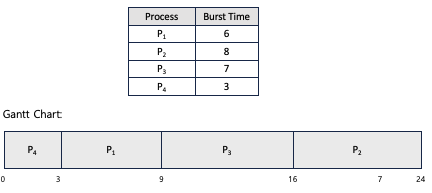

# OS

# 운영체제 개요

---

## 운영체제의 역할과 목적

- **정의:**
    - 사용자에게 편리한 인터페이스 환경을 제공하고 컴퓨터 시스템의 자원을 효율적으로 관리하는 일종의 **소프트웨어**
- **특징:**
    - 컴퓨터 시스템의 자원을 관리하고, 작업의 실행 순서를 제어하여 충돌을 방지함
    - 사용자와 하드웨어 간 **추상화 계층**을 제공하여 복잡성을 숨기고, 간단한 명령으로 시스템 제어를 가능하게 함
    - 프로세스 간 동기화와 통신을 지원하며, 데이터를 안전하게 보호함
- **예시**:
    - **Windows**: 사용자 친화적인 GUI와 강력한 멀티태스킹 기능 제공
    - **Linux**: 높은 안정성과 유연성, 오픈 소스 기반으로 개발 및 서버 운영에 최적화
    - **macOS**: 애플 하드웨어에 최적화된 GUI와 성능 제공
    - **Android/iOS**: 모바일 디바이스에서 최적화된 사용자 경험 제공

**운영체제의 역할**

- **사용자 관점**: 사용자와 시스템 간 인터페이스로써 사용의 용이성을 제공
- **시스템 관점**: 자원 할당자, 제어 프로그램

- `자원 관리` : 여러 응용 프로그램이 자원을 요청하면 적절한 순서로 배분하고 회수하여 자원을 효율적으로 관리
- `자원 보호` : CPU, 메모리 등에 대한 사용자와 응용 프로그램의 직접 접근을 막음
- `하드웨어 인터페이스 제공` : 다양한 제조사, 각기 다른 구성으로 되어있는 마우스, 키보드 등을 복잡한 과정없이 사용할 수 있도록 하드웨어 인터페이스를 제공
    - 일부 하드웨어는 직접 드라이버(=하드웨어 인터페이스)를 설치해야 함
- `소프트웨어 인터페이스 제공` : 사용자가 운영체제를 편리하게 사용하기 위해 제공되는 것으로, 대부분의 작업을 마우스로 수행하거나 스마트폰의 터치스크린 등을 통해 제공되는 기능을 말함

**운영체제의 목적**

- **사용자 관점**:
    - 사용자와 시스템 간의 인터페이스로 동작하며, 컴퓨터를 쉽게 사용할 수 있도록 편의성을 제공
    - 응용 프로그램 실행과 자원 접근을 간편하게 지원
- **시스템 관점**:
    - **자원 할당자(Resource Allocator)**:
        - CPU, 메모리, 저장 장치 등의 자원을 여러 응용 프로그램에 효율적으로 할당
    - **제어 프로그램(Control Program)**:
        - 실행 중인 프로그램과 시스템 자원을 제어하며, 충돌 방지 및 데이터 보호를 수행
- **구체적인 역할**:
    - `자원 관리`:
        - 여러 응용 프로그램이 자원을 요청하면 적절한 순서로 분배하고 회수하여 자원을 효율적으로 관리
        - CPU 스케줄링, 메모리 관리, 디스크 스케줄링 등
    - `자원 보호`:
        - CPU, 메모리 등에 대한 사용자 및 응용 프로그램의 **직접 접근을 제한**하여 시스템 안정성 보장
    - `하드웨어 인터페이스 제공`:
        - 다양한 제조사의 마우스, 키보드, 디스크 등 하드웨어를 복잡한 과정 없이 사용할 수 있도록 표준화된 인터페이스 제공
        - 일부 하드웨어는 드라이버 설치가 필요함
    - `소프트웨어 인터페이스 제공`:
        - 사용자가 운영체제를 쉽게 사용할 수 있도록 GUI, CLI, 또는 터치스크린과 같은 인터페이스 제공
        - 작업 수행을 위한 명령어 및 UI 지원

---

## 운영체제의 구조 (Structure of Operating Systems)

> 위 그림은 운영체제의 계층 구조를 나타내며, 하드웨어에서 사용자와 시스템 프로그램까지의 상호작용 과정을 보여줌

### 커널(Kernel)

- **정의**:
    - 운영체제의 핵심으로, **하드웨어와 소프트웨어 간의 중재 역할**을 담당하며, 시스템 자원(CPU, 메모리, 입출력 장치 등)을 관리함
    - 프로세스 관리, 메모리 관리, 파일 시스템, 입출력 관리 등 운영체제의 핵심 기능을 수행하는 부분
- **특징**:
    - 커널은 운영체제의 가장 중요한 부분으로, 시스템의 안정성과 성능을 좌우함
    - 시스템 호출(System Call)과 드라이버를 통해 하드웨어 및 소프트웨어와 상호작용
    - 단일형, 계층형, 마이크로커널 등 다양한 아키텍처로 구현 가능
    - **계층적 역할**:
        - 커널은 **하드웨어와 사용자 프로그램 사이의 중재 계층**으로 작동하며, 하드웨어 제어와 사용자 요청을 연결함
        - 시스템 호출 인터페이스를 통해 사용자 모드에서 커널 모드로 전환하여 자원을 관리함
        - 운영체제 계층 구조에서 커널은 하드웨어 위에 위치하며, 사용자 인터페이스와 시스템 프로그램을 지원함
- **동작 방식**:
    - **시스템 호출**:
        - 응용 프로그램이 하드웨어 자원(CPU, 메모리 등)에 접근하려면 커널의 시스템 호출을 통해 요청함
        - 예: 파일 저장 시, 응용 프로그램은 직접 디스크에 쓰는 대신 커널에 요청하여 저장 작업을 처리
    - **드라이버**:
        - 커널 내부에서 **하드웨어 제어**를 담당하며, 키보드, 마우스, 네트워크 장치와 같은 하드웨어와 통신
- **장점**:
    - 자원의 효율적인 관리로 시스템 성능 최적화
    - 하드웨어 추상화를 통해 다양한 장치를 간편하게 제어 가능
    - 프로세스 간 충돌 방지 및 동기화 지원
- **단점**:
    - 커널에 문제가 발생하면 시스템 전체가 불안정해질 수 있음
    - 커널이 크고 복잡할수록 디버깅 및 유지보수가 어려워짐
- **활용**:
    - **단일형 커널**: MS-DOS, 초기 Unix (빠른 성능 제공, 그러나 유지보수 어려움)
    - **계층형 커널**: Windows, 현대의 대부분 운영체제 (디버깅 및 확장 용이)
    - **마이크로커널**: macOS, iOS (가벼운 커널, 독립 모듈로 안정성 강화)

### 사용자 모드(User Mode) vs 커널 모드(Kernel Mode)

> 위 그림은 사용자 모드(User Mode)와 커널 모드(Kernel Mode)간의 관계를 보여주며, 시스템 호출(System Call)을 통해 응용 프로그램이 시스템 자원(Resource)에 접근하는 과정을 나타냄
>  
- **정의**:
    - **사용자 모드**: 응용 프로그램이 실행되는 제한된 환경으로, 시스템 자원에 직접 접근하지 못함
    - **커널 모드**: 커널에서 실행되는 특권 모드로, 모든 시스템 자원(CPU, 메모리, 입출력 장치)에 접근 가능
- **특징**:
    - **사용자 모드**:
        - 일반 응용 프로그램이 실행되는 모드
        - 시스템 호출을 통해서만 커널에 요청 가능
    - **커널 모드**:
        - 커널이 하드웨어와 직접 통신하여 자원을 관리
        - 시스템의 모든 권한을 가짐
    - **모드 전환**:
        - 사용자 모드 → 커널 모드: 응용 프로그램이 시스템 호출을 통해 요청할 때 전환
        - 커널 모드 → 사용자 모드: 커널 작업이 끝난 후, 응용 프로그램 실행으로 복귀
- **동작 방식**:
    - 응용 프로그램이 작업을 요청하면 사용자 모드에서 시스템 호출을 통해 커널 모드로 전환
    - 커널은 요청을 처리하고 사용자 모드로 돌아가 작업 결과를 응용 프로그램에 반환
- **장점**:
    - 사용자 모드와 커널 모드 분리를 통해 시스템 안정성 강화
    - 응용 프로그램이 하드웨어에 직접 접근하지 못하도록 하여 보안 문제 최소화
- **단점**:
    - 사용자 모드에서 커널 모드로의 빈번한 전환은 성능 저하의 원인이 될 수 있음
    - 커널 모드의 버그는 시스템 전체에 영향을 미칠 가능성이 있음
- **활용**:
    - 현대의 모든 운영체제는 사용자 모드와 커널 모드로 구분된 구조를 사용함
        - 예시: Windows의 Win32 API, Unix/Linux의 POSIX API 등은 시스템 호출 인터페이스를 통해 사용자 모드에서 커널 모드로 전환

---

## 운영체제 종류(Types of Operating Systems)

### 단일 사용자/다중 사용자(Single-user/Multitasking)

**단일 사용자 운영체제**

- **정의**: 한 번에 하나의 사용자만 시스템에 접근할 수 있도록 설계된 운영체제
- **예시**: MS-DOS, 초기 버전의 Windows (Windows 95/98).
- **특징**:
    - 주로 개인용 컴퓨터에서 사용되며, 사용자의 작업에 집중되어 있음
    - 간단하고 자원 관리가 비교적 쉬움

**다중 사용자 운영체제**

- **정의**: 여러 사용자가 동시에 시스템 자원을 공유하며 사용할 수 있는 운영체제
- **예시**: UNIX, Linux, Windows Server
- **특징**:
    - 주로 서버나 대규모 컴퓨팅 환경에서 사용됨
    - 사용자별로 자원을 효과적으로 관리하여 충돌을 방지
    - 보안 및 자원 분배에 중점을 둠

### 단일 작업/다중 작업(Single-tasking/Multitasking)

**단일 작업 운영체제**:

- 정의: 한 번에 하나의 작업만 수행할 수 있는 운영체제
- **예시**: MS-DOS
- **특징**:
    - 구조가 단순하고 자원 요구량이 적음
    - 작업이 완료되기 전까지 다른 작업을 수행할 수 없음

**다중 작업 운영체제**:

- 정의: 여러 작업을 동시에 실행하거나 빠르게 전환하며 처리할 수 있는 운영체제
- **예시**: Windows, macOS, Linux
- **특징**:
    - CPU의 시간을 분할하여 여러 작업을 동시에 처리하는 것처럼 보이게 함
    - 효율적인 작업 관리와 자원 활용을 통해 사용자 경험을 향상

### 분산 OS(Distributed Operating Systems)

- **정의**:
    - 네트워크에 연결된 여러 컴퓨터가 협력하여 하나의 통합된 시스템처럼 작동하도록 설계된 운영체제
    - 데이터와 작업이 네트워크를 통해 분산되어 처리됨
- **특징**:
    1. **자원의 투명한 공유**: 사용자는 각 시스템의 물리적 위치를 알 필요 없이 자원을 사용할 수 있음
    2. **부하 분산**: 작업이 여러 시스템에 분배되어 처리 효율성이 높아짐
    3. **고가용성**: 시스템 장애 시에도 다른 시스템이 작업을 이어받아 지속적으로 운영 가능
- **예시**:
    - Google File System, Apache Hadoop, Kubernetes

### 실시간 OS(Real-Time Operating Systems)

- **정의**:
    - 특정 시간 제약 안에서 작업을 처리하도록 설계된 운영체제
    - 주로 시간에 민감한 작업에 사용됨
- **구분**:
    - **하드 실시간 OS**: 시간 제약을 반드시 지켜야 하는 경우 사용 (예: 항공기 제어 시스템)
    - **소프트 실시간 OS**: 시간 제약을 지키는 것이 중요하지만 반드시 지켜야 하는 것은 아닌 경우 사용 (예: 스트리밍 서비스)
- **예시**:
    - VxWorks, RTLinux, FreeRTOS
    - 사용 사례: 의료 기기, 공장 자동화 시스템, 항공기 시스템

---

# 프로세스 관리 (Process Management)

---

## 프로세스와 스레드 (Processes and Threads)

### 프로세스 상태(Process States)

**프로세스**

- **정의**:
    - 운영체제에서 **실행 중인 프로그램**을 의미하는 독립적인 실행 단위
    - 실행에 필요한 자원(코드, 데이터, 스택, 힙)과 현재 상태 정보를 포함
    
    
    
    > 위 그림은 운영체제에서 각각의 프로세스가 독립적인 메모리 공간(Code, Data, Stack, Heap)을 가지며 서로 격리되어 실행됨을 보여줌
    > 
- **특징:**
    - 프로세스는 서로 독립적이며, 각 프로세스는 고유한 메모리 공간을 가짐
    - 운영체제는 프로세스의 자원 할당과 관리를 담당
    - 운영체제는 PCB (Process Control Block)를 통해 각 프로세스의 상태와 자원을 관리하며, 프로세스 전환 시 PCB를 참조하여 실행 상태를 저장하고 복구함
    - 프로세스는 생성, 준비, 실행, 대기, 종료의 **상태**를 가짐
        - **생성 (New)**
            - **정의**: 프로세스가 생성되었지만 아직 실행되지 않은 상태
            - **특징**:
                - 프로세스의 메모리 공간이 할당되고 초기화 작업이 이루어짐
                - 준비 상태(Ready)로 전이됨
        - **준비 (Ready)**
            - **정의**: 프로세스가 CPU를 할당받기 위해 대기 중인 상태
            - **특징**:
                - 실행 준비가 완료되었으나 CPU가 할당되지 않은 상태
                - CPU가 할당되면 실행 상태(Running)로 전이됨
        - **실행 (Running)**
            - **정의**: CPU가 프로세스에 할당되어 실제로 명령어가 실행되고 있는 상태
            - **특징**:
                - 프로세스가 CPU를 사용하여 작업을 수행함
                - 실행이 완료되면 종료 상태(Terminated)로 전이됨
                - 타이머에 의해 인터럽트를 받으면 준비 상태(Ready)로 전이됨
                - I/O 작업이 필요하면 대기 상태(Waiting)로 전이됨
        - **대기 (Waiting)**
            - **정의**: 프로세스가 I/O 작업이나 특정 이벤트를 기다리고 있는 상태
            - **특징**:
                - 파일 읽기, 네트워크 응답 등 외부 작업 대기 중인 상태
                - 작업이 완료되면 준비 상태(Ready)로 전이됨
        - **종료 (Terminated)**
            - **정의**: 프로세스의 실행이 완료되어 종료된 상태
            - **특징**:
                - 프로세스가 사용하던 자원이 해제됨
                - 운영체제에 의해 프로세스 정보가 정리됨
        
        **상태전이도:**
        
        
        
        > 위 그림은 프로세스의 상태 전이를 나타내며, `New` 상태에서 시작해 `Terminated` 상태로 종료되는 과정을 설명함
        > 

**PCB (Process Control Block)**

- **정의**:
    - 프로세스 생성 시 운영체제가 생성하는 자료구조로, 프로세스의 상태와 정보를 관리함
- **특징**:
    - 각 프로세스의 실행과 관리를 위해 필수적인 정보를 포함함
    - 운영체제가 프로세스 전환(Context Switch)을 수행할 때 PCB를 참조하여 상태를 복구하거나 저장함
    - 프로세스별로 고유한 PCB가 생성되며, 프로세스의 전체 라이프사이클 동안 유지됨
- **포함 정보**:
    1. **Process 상태**: New, Ready, Running, Waiting, Terminated
    2. **프로세스 ID**: 각 프로세스를 고유하게 식별하는 ID
    3. **CPU 레지스터**: 프로세스 실행에 필요한 레지스터 정보
    4. **스케줄링 정보**: 우선순위, 스케줄링 큐 위치 등 스케줄링에 필요한 데이터
    5. **메모리 관련 정보**: 프로세스의 메모리 영역 정보 (코드, 데이터, 스택, 힙)
    6. **오픈된 파일 정보**: 프로세스가 접근 중인 파일 목록
    7. **통계 정보**: CPU 사용 시간, 메모리 사용량 등 성능 데이터
    8. **어카운팅 정보**: 프로세스별 CPU 및 메모리 자원 사용 통계

### 스레드(Thread)

- **정의**:
    - 프로세스 내에서 실행되는 작은 실행 단위
    - 동일한 프로세스 내에서 메모리와 자원을 공유하며 독립적으로 실행되는 제어의 흐름
        
        
        
        > 위 그림은 하나의 프로세스 내에서 스레드들이 Code, Data, Heap 메모리를 공유하며, 각 스레드는 독립적인 Stack을 가지는 구조를 보여줌
        > 
- **특징**:
    - 같은 프로세스 내의 스레드는 메모리 공간(코드, 데이터 등)을 공유
    - 스레드는 프로세스보다 더 적은 자원으로 생성되고 관리됨
    - 스레드 간의 전환은 프로세스 간의 전환보다 빠름
    - 여러 스레드를 사용하여 동시에 작업을 수행할 수 있어 효율적인 프로그램 실행이 가능
    - 여러 스레드가 동시에 실행되며, 프로세스의 자원을 공유하면서 독립적으로 실행
- **장점**:
    - **응답 속도 향상**: 사용자와의 상호작용이 빠르게 이루어질 수 있음
    - **자원 공유로 메모리 소비 감소**: 별도의 메모리 공간 생성 없이 효율적으로 자원을 활용할 수 있음
    - **병렬 처리를 통한 성능 개선**: 다중 코어 환경에서 여러 작업을 병렬로 처리할 수 있음
    - **작업 간 데이터 공유가 용이**: 같은 프로세스 내 메모리를 공유하므로 데이터 교환이 빠르게 이루어질 수 있음
- **단점**:
    - **동기화 문제 발생 가능**: 여러 스레드가 동일한 메모리 공간을 사용하므로 데이터의 불일치 문제가 발생할 수 있음
    - **오류 전파 가능성**: 하나의 스레드에서 오류 발생 시 전체 프로세스에 영향을 줄 수 있음
- **예시:**
  

      
C 코드: 멀티스레딩 구현 (pthread 라이브러리를 사용하여 두 개의 스레드 실행)

        
        #include <stdio.h>
        #include <pthread.h>
        
        void* thread_function(void* arg) {
            printf("Thread %d is running.\n", *(int*)arg);
            return NULL;
        }
        
        int main() {
            pthread_t threads[2];
            int thread_args[2] = {1, 2};
        
            for (int i = 0; i < 2; i++) {
                pthread_create(&threads[i], NULL, thread_function, &thread_args[i]);
            }
        
            for (int i = 0; i < 2; i++) {
                pthread_join(threads[i], NULL);
            }
        
            return 0;
        }
        
        - 출력 결과:
            - 스레드 실행 순서는 운영 체제의 스케줄링에 따라 결정되며, `Thread 1 is running.`과 `Thread 2 is running.`의 순서는 실행마다 달라질 수 있음

---

## CPU 스케줄링 (CPU Scheduling)

- **정의**:
    - 제한된 CPU를 여러 프로세스가 동시에 사용하려 할 때, 어떤 프로세스를 실행(run 상태)할지 결정하는 운영체제의 메커니즘
- **특징**:
    - CPU를 최대한 효율적으로 사용하기 위해 프로세스의 우선순위, 실행 시간, 대기 시간 등을 고려하여 스케줄링
    - 레디 큐는 실행 대기 중인 프로세스를 관리하는 구조로, 스케줄링 알고리즘에 따라 프로세스 순서를 결정함
    - 스케줄링은 크게 선점형(Preemptive)과 비선점형(Non-preemptive)으로 구분됨
- **동작 방식**:
    - CPU 스케줄러는 레디 큐에 있는 프로세스 중 하나를 선택해 CPU를 할당
    - 선택된 프로세스는 실행 상태(run)로 전환되며, 나머지는 레디 큐에 대기

### 선점형 스케줄링 (Preemptive Scheduling)

- **정의**:
    - 실행 중인 프로세스가 CPU를 점유하고 있을 때, 운영 체제가 다른 프로세스에 CPU 자원을 할당하기 위해 현재 프로세스를 강제로 중단할 수 있는 방식
- **특징**:
    - 운영 체제가 특정 조건(예: 높은 우선순위의 프로세스가 대기 중일 때)에서 현재 실행 중인 프로세스를 중단하고 다른 프로세스에 CPU를 할당
    - Context Switching(문맥 교환)이 필수적으로 발생
    - 실시간 응답 환경, 데드라인 응답 환경 등 우선순위가 높은 프로세스를 먼저 처리해야 하는 경우에 유용
- **동작 방식**:
    - 새로운 프로세스가 도착하면 실행 중인 프로세스와 우선순위를 비교
    - 높은 우선순위 프로세스가 있다면 현재 프로세스를 중단하고 대기 상태로 전환
    - 새로운 프로세스에 CPU를 할당
- **장점**:
    - 실시간 시스템에서 효과적
    - 높은 우선순위 작업의 데드라인 준수 가능
- **단점**:
    - 문맥 교환으로 인한 성능 저하 가능
    - 낮은 우선순위 작업이 기아 상태(Starvation)에 빠질 가능성
- **활용**:
    - 대표 알고리즘: Round Robin, STCF

**Round Robin (RR)**

- **정의**:
    - 프로세스들 사이에 우선순위를 두지 않고, 순서대로 시간 단위(Time Quantum/Slice)로 CPU를 할당하는 방식
- **특징**:
    - 타임 퀀텀 단위로 프로세스를 번갈아가며 실행
    - 타임 퀀텀이 끝나면 프로세스는 대기열의 뒤로 이동하며 문맥 교환이 발생
- **동작 방식**:
    - 대기열에서 첫 번째 프로세스를 CPU에 할당
    - 타임 퀀텀 종료 시 프로세스는 대기열의 끝으로 이동
    - 모든 프로세스가 완료될 때까지 반복
        
        
        
        > 위 그림은 타임 퀀텀 4인 Round Robin 스케줄링에서 P1, P2, P3 프로세스가 도착 순서대로 4단위 시간씩 CPU를 번갈아가며 할당받아 실행되는 것을 보여줌
        > 
- **장점**:
    - 응답 시간이 빠름
    - 공정한 CPU 자원 분배
- **단점**:
    - 타임 퀀텀 크기에 따라 성능이 달라짐
    - 문맥 교환에 따른 오버헤드 발생
- **활용**:
    - 사용자 응답 시간이 중요한 시스템

**Priority Scheduling**

- **정의**:
    - 프로세스를 우선순위에 따라서 순서대로 처리하는 알고리즘
- **특징**:
    - 도착한 프로세스의 우선순위와 현재 실행 중인 프로세스의 우선순위를 비교하여 높은 우선순위 작업부터 처리
    - 우선순위가 같을 경우 FCFS(First Come First Serve)를 적용
- **동작 방식**:
    - 프로세스 도착 시 우선순위를 확인
    - 높은 우선순위의 작업이 있으면 먼저 실행
        
        
        
        > 위 그림은 Priority Scheduling에서 프로세스가 우선순위에 따라 P2, P5, P1, P3, P4 순서대로 CPU를 할당받아 실행되는 것을 보여줌
        > 
- **장점**:
    - 긴급한 작업의 빠른 처리 가능
- **단점**:
    - 낮은 우선순위 작업의 지연 또는 기아 상태 발생 가능
- **활용**:
    - 작업 중요도가 명확히 구분되는 시스템

**Multilevel Feedback Queue (MLFQ)**

- **정의**:
    - 프로세스를 목적에 맞게 여러 개의 큐로 나누고, 각 큐마다 다른 스케줄링 알고리즘을 적용하는 방식
- **특징**:
    - CPU 사용량에 따라 우선순위를 조정
    - Starvation 문제를 해결하기 위해 Aging 기법을 적용
    - 높은 우선순위 큐에는 Round Robin을, 낮은 우선순위 큐에는 FCFS를 적용
- **동작 방식**:
    - 새로운 작업은 가장 높은 우선순위의 큐에 배치
    - 타임 퀀텀 소진 시 낮은 우선순위로 이동
    - 주기적으로 우선순위를 높이는 Periodic Boosting을 사용
        
        
        
        > 위 그림은 Multi-Level Queue 스케줄링에서 프로세스를 우선순위에 따라 real-time processes, system processes, interactive processes, batch processes 순서로 분류하여 높은 우선순위부터 실행하는 구조를 보여줌
        > 
- **장점**:
    - 실시간성과 반환 시간의 균형
    - 다양한 작업 환경에 적합
- **단점**:
    - 스케줄러 설계가 복잡
    - 우선순위 속임수 가능
- **활용**:
    - 실시간 작업과 배치 작업이 혼재된 환경

### 비선점형 스케줄링 (Non-preemptive Scheduling)

- **정의**:
    - 한 프로세스가 CPU를 할당받으면 작업 종료 후 CPU 반환 시까지 다른 프로세스는 CPU 점유가 불가능한 방식
- **특징**:
    - 문맥 교환 오버헤드가 적음
    - 현재 작업이 끝날 때까지 다른 작업은 대기
- **동작 방식**:
    - 프로세스 도착 순서에 따라 대기열에 추가
    - 실행 중인 프로세스가 종료되면 대기열에서 첫 번째 프로세스를 CPU에 할당
- **장점**:
    - 구현이 간단
    - 문맥 교환 오버헤드가 없음
- **단점**:
    - 높은 우선순위 작업의 처리 지연 가능
    - Convoy Effect 발생 가능
- **활용**:
    - 배치 시스템, 간단한 응답 환경
    - 대표 알고리즘: FCFS, SJF

**FCFS (First Come First Serve)**

- **정의**:
    - 먼저 도착한 프로세스부터 처리하는 방식
- **특징**:
    - 공평한 처리 순서 보장
    - Convoy Effect 발생 가능
- **동작 방식**:
    - 도착한 순서대로 대기열에 추가
    - 대기열의 첫 번째 프로세스를 실행
        
        
        
        > 위 그림은 Multi-Level Queue 스케줄링에서 프로세스를 우선순위에 따라 real-time processes, system processes, interactive processes, batch processes 순서로 분류하여 높은 우선순위부터 실행하는 구조를 보여줌
        > 
- **장점**:
    - 구현이 간단
    - 공평한 자원 분배
- **단점**:
    - 긴 작업이 앞에 있을 경우 뒤의 작업들이 지연됨 (Convoy Effect)
- **활용**:
    - 처리 시간이 비슷한 작업들

**SJF (Shortest Job First)**

- **정의**:
    - 대기 중인 작업 중 실행 시간이 가장 짧은 작업부터 처리하는 방식
- **특징**:
    - 짧은 작업 우선 처리
    - CPU Burst Time을 미리 알아야 함
- **동작 방식**:
    - 대기 중인 작업의 CPU Burst Time을 비교
    - 가장 짧은 작업을 CPU에 할당
        
        
        
        > 위 그림은 SJF(Shortest Job First) 스케줄링에서 Burst Time이 낮은 순서대로 P4, P1, P3, P2 프로세스가 CPU를 할당받아 실행되는 것을 보여줌
        > 
- **장점**:
    - 평균 대기 시간 감소
    - 반환 시간 최적화 가능
- **단점**:
    - 작업 시간 예측이 어려움
    - 기아 상태 발생 가능
- **활용**:
    - 짧은 작업이 많은 환경

### 스케줄링 성능 평가

- **정의**:
    - CPU 스케줄링의 효과를 측정하고 평가하기 위해 사용되는 성능 지표
- **특징**:
    - CPU 스케줄링은 성능 향상과 자원 활용 극대화를 목표로 하며, 이를 평가하기 위해 다양한 매트릭(Metrics)을 사용
    - 사용되는 성능 지표는 상황과 시스템의 목표에 따라 중요도가 달라질 수 있음
    - 주요 성능 지표로 반환시간, 응답시간, 형평성, 처리율, 마감시간 등이 사용됨
    - 각 지표는 특정 상황에 맞는 스케줄링 정책을 선택하는 데 도움을 줌
- **동작 방식**:
    - 반환시간, 응답시간, 처리율 등 매트릭을 통해 스케줄링 정책의 성능을 측정
    - 시스템의 특성과 목표에 따라 가장 중요한 매트릭을 우선적으로 고려
    - 스케줄링 알고리즘이 적절히 동작하도록 평가 결과를 피드백
- **주요 매트릭**:
    1. **반환시간 (Turnaround time)**:
        - **정의**: 작업이 제출된 시간과 완료된 시간 간의 차이를 의미
        - **식**: $T_{turnaround}=T_{completion}−T_{arrival}$
        - **장점**: 작업이 얼마나 빠르게 완료되었는지를 측정 가능
        - **단점**: 특정 작업이 길어지면 반환시간이 과도하게 늘어날 수 있음
    2. **응답시간 (Response time)**:
        - **정의**: 작업이 제출된 후 실행이 시작될 때까지의 시간을 의미
        - **식**:$T_{response}=T_{start}−T_{arrival}$
        - **장점**: 시스템 반응 속도를 측정 가능
        - **단점**: 응답시간을 줄이기 위해 반환시간이나 처리율을 희생할 수 있음
    3. **형평성 (Fairness)**:
        - **정의**: 작업 간의 완료 시간 차이를 줄여 공평하게 자원을 할당하는 정도를 평가
        - **식**: $F =|T_{\text{completion}}^{P1} - T_{\text{completion}}^{P2}|$
        - **장점**: 모든 작업에 공정한 자원 할당을 보장
        - **단점**: 형평성을 지나치게 중시하면 중요한 작업의 우선순위가 낮아질 수 있음
    4. **처리율 (Throughput)**:
        - **정의**: 단위 시간 동안 완료된 작업의 수를 의미
        - **식**: $T_{throughput} = \frac{\text{Number of jobs completed}}{\text{Total time}}$
        - **장점**: 시스템의 작업 처리 효율성을 측정 가능
        - **단점**: 처리율을 높이기 위해 짧은 작업 위주로 처리하면 긴 작업이 지연될 가능성이 있음
    5. **마감시간 (Deadline)**:
        - **정의**: 작업이 지정된 마감시간 내에 완료되었는지를 평가
        - **식**: $D = T_{completion} \leq T_{deadline}$
        - **장점**: 실시간 시스템에서 중요한 작업의 적시 완료 보장
        - **단점**: 마감시간을 충족하기 위해 다른 작업의 성능을 희생할 수 있음
- **장점**:
    - 다양한 지표를 통해 스케줄링 정책의 효과를 다각도로 평가 가능
    - 시스템의 목표와 요구사항에 맞는 스케줄링 알고리즘 선택에 도움
- **단점**:
    - 모든 매트릭을 동시에 만족시키기 어려움 (예: 응답시간과 형평성 간의 상충)
    - 특정 지표에 집중할 경우 다른 성능 요소가 저하될 가능성
- **활용**:
    - 실시간 시스템에서는 마감시간을 우선 고려
    - 사용자와의 상호작용이 많은 환경에서는 응답시간을 중시
    - 배치 작업 환경에서는 처리율을 최대화

---

## 동기화 (Synchronization)

- **정의**:
    - 여러 프로세스나 스레드가 동시에 실행될 때, 공유 자원의 일관성을 유지하고 정확한 실행 순서를 보장하기 위한 메커니즘
- **특징**:
    - 프로세스 간의 데이터 충돌 및 무결성 문제를 해결
    - 상호 배제(Mutual Exclusion)를 통해 한 번에 하나의 프로세스만 공유 자원에 접근 가능
    - 임계 구역(Critical Section) 문제를 해결하며 진행 조건(Progress)과 한정 대기(Bounded Waiting)를 보장
    - 동기화를 위해 세마포어, 모니터, 뮤텍스, 조건 변수와 같은 기법을 사용
- **동작 방식**:
    - 공유 자원에 접근하기 전, 특정 조건을 만족한 프로세스만 접근 허용
    - 접근 종료 후, 대기 중인 다른 프로세스가 자원을 사용할 수 있도록 관리
    - 필요한 경우 대기와 신호를 활용해 동기화 상태를 유지

### 임계 구역 문제 (Critical Section Problem)

- **정의**:
    - 여러 프로세스가 동시에 접근하면 문제가 발생할 수 있는 공유 자원의 코드 영역
- **특징**:
    - **상호 배제(Mutual Exclusion)**: 하나의 프로세스만 임계 구역에 접근 가능
    - **진행 조건(Progress)**: 임계 구역에 들어갈 프로세스를 공정하게 결정
    - **한정 대기(Bounded Waiting)**: 특정 프로세스가 무한 대기하지 않도록 보장
- **동작 방식**:
    - 프로세스는 임계 구역에 진입하기 전에 허가를 요청
    - 한 번에 하나의 프로세스만 임계 구역에 진입 가능
    - 작업 종료 후, 다른 프로세스가 임계 구역에 접근하도록 허용

### 세마포어(Semaphore)와 모니터(Monitor)

**세마포어**

- **정의**:
    - 프로세스 간 동기화 및 상호 배제를 위해 사용되는 정수형 변수
- **특징**:
    - **값 관리**: 세마포어 값(S)을 통해 공유 자원 접근 가능 여부를 관리
    - **종류**:
        - **카운팅 세마포어**: 0 이상의 값을 가지며, 자원 개수를 관리
        - **이진 세마포어**: 0과 1만 가지며, 뮤텍스와 유사하게 동작
    - **연산**:
        - **Wait(P 연산)**: 세마포어 값을 감소시키며, 값이 0보다 작아지면 대기 상태로 전환
        - **Signal(V 연산)**: 세마포어 값을 증가시키며, 대기 중인 프로세스를 깨움
- **동작 방식**:
    - Wait(P 연산): 세마포어 값을 감소시키며, 값이 0보다 작아지면 프로세스를 대기 상태로 전환
    - Signal(V 연산): 세마포어 값을 증가시키며, 대기 중인 프로세스를 깨워 실행
    - 여러 프로세스가 동일 자원을 요청하면 세마포어 값이 음수가 되어 대기 큐에 추가됨
- **장점**:
    - 간단하면서도 효율적인 자원 관리 가능
    - 여러 프로세스 간 동기화 및 상호 배제를 효과적으로 지원
    - 카운팅 세마포어를 통해 여러 자원 동시 관리 가능
    - 분산 시스템에서도 활용 가능
- **단점**:
    - **Busy Waiting** 문제: Wait 연산 중 자원이 비활성화되었을 때 CPU 자원을 낭비하며 대기
    - 프로그래머가 Wait와 Signal 호출 순서를 잘못 설정하면 데드락(Deadlock)이나 기아 상태(Starvation)가 발생할 수 있음
    - 다중 세마포어 사용 시 복잡도가 증가하고 관리 어려움
- **활용**:
    - 생산자-소비자 문제, 독자-작가 문제, 제한된 자원 접근 관리
    - 제한된 연결 개수(예: 데이터베이스 커넥션 풀)와 같은 자원 제어에 유용
- **예시:**
  

      
C 코드: 세마포어를 활용한 임계 구역 관리 (pthread와 sem_t 사용)

        
        #include <semaphore.h>
        #include <pthread.h>
        #include <stdio.h>
        
        sem_t semaphore; // 세마포어 변수 선언
        
        void* thread_function(void* arg) {
            sem_wait(&semaphore); // 세마포어 잠금 (임계 구역에 진입)
            printf("Thread %ld is in the critical section\n", pthread_self()); // 현재 스레드가 임계 구역에 진입했음을 출력
            sem_post(&semaphore); // 세마포어 해제 (임계 구역에서 나옴)
            return NULL;
        }
        
        int main() {
            pthread_t threads[3]; // 스레드 배열 생성
            sem_init(&semaphore, 0, 1); // 세마포어 초기화 (이진 세마포어로 설정, 초기 값 1)
        
            for (int i = 0; i < 3; i++) {
                pthread_create(&threads[i], NULL, thread_function, NULL); // 스레드 생성
            }
        
            for (int i = 0; i < 3; i++) {
                pthread_join(threads[i], NULL); // 각 스레드가 종료될 때까지 대기
            }
        
            sem_destroy(&semaphore); // 세마포어 제거
            return 0;
        }
        
        

**모니터**

- **정의**:
    - 공유 자원을 관리하고 동기화를 지원하는 고수준의 동기화 도구
- **특징**:
    - **자원 은닉**: 공유 자원은 모니터 내부에서 숨겨지고, 접근 인터페이스(프로시저)만 제공
    - **상호 배제**: 한 번에 하나의 프로세스만 모니터 내부에서 작업 가능
    - **조건 관리**: 조건 변수와 Wait, Signal 연산을 통해 동기화
    - 동시성을 프로그래밍 언어 수준에서 지원하여 복잡도를 낮춤
    - 자바의 `synchronized` 키워드와 Python의 `threading.Condition` 등에서 사용 가능
- **동작 방식**:
    - 모니터는 요청을 순차적으로 처리하며, 공유 자원의 일관성을 보장
    - 조건이 만족되지 않을 경우 `wait`을 호출해 스레드를 대기 상태로 전환
    - 조건 만족 시 `signal`을 호출해 대기 중인 스레드를 활성화
    - 작업 완료 후 다른 프로세스가 자원을 사용할 수 있도록 관리
- **장점**:
    - **코드 간결성**: 고수준 동기화 지원으로 프로그래머의 구현 부담 감소
    - **안전성**: 공유 자원 접근을 제한하며, 상호 배제를 기본적으로 지원
    - 다중 조건 변수 지원으로 복잡한 동기화 문제 해결
- **단점**:
    - 운영체제나 프로그래밍 언어에 따라 구현 차이가 있음
    - 자원이 제한된 시스템에서는 비효율적일 수 있음
    - Wait-Signal 순서 오류 시 예상치 못한 결과 발생 가능
- **활용**:
    - 자바에서 스레드 동기화(`synchronized`)와 조건 관리에 사용
    - 생산자-소비자 패턴, 작업 대기열 관리, 실시간 데이터 처리
- **예시:**
  

      
Java 코드: synchronized 키워드를 사용한 모니터 기반 임계 구역 관리

      
        class MonitorExample {
          private int sharedResource = 0; // 공유 자원
        
          // synchronized를 사용해 임계 구역 설정
          public synchronized void increment() { 
            sharedResource++;
            System.out.println(Thread.currentThread().getName() + " incremented: " + sharedResource);
          }
        
          public synchronized void decrement() { 
            sharedResource--;
            System.out.println(Thread.currentThread().getName() + " decremented: " + sharedResource);
          }
        }
        
        public class MonitorDemo {
          public static void main(String[] args) {
            MonitorExample monitor = new MonitorExample(); // 모니터 객체 생성
        
            // 스레드들이 공유 자원에 접근
            Thread t1 = new Thread(() -> {
              for (int i = 0; i < 5; i++) monitor.increment(); // 자원 증가
            });
        
            Thread t2 = new Thread(() -> {
              for (int i = 0; i < 5; i++) monitor.decrement(); // 자원 감소
            });
        
            t1.start(); // 스레드 시작
            t2.start(); // 스레드 시작
          }
        }

### 뮤텍스(Mutex)와 조건 변수(Condition Variables)

**뮤텍스**

- **정의**:
    - 임계 구역(Critical Section)에 한 번에 하나의 스레드만 접근하도록 상호 배제를 보장하는 동기화 기법
- **특징**:
    - **상호 배제**: 자원을 사용하려는 스레드는 뮤텍스를 잠금(Lock)으로써 다른 스레드의 접근을 방지
    - **소유권**: 뮤텍스는 특정 스레드가 소유하며, 소유한 스레드만 잠금 해제 가능
    - **데드락 위험**: 잘못된 사용(예: 잠금 후 해제를 하지 않거나 두 개의 뮤텍스가 순환적으로 대기하는 경우)에 따라 데드락(Deadlock) 상태에 빠질 수 있음
- **동작 방식**:
    - **Lock**: 자원을 사용하려는 스레드가 뮤텍스를 잠금
    - **Critical Section**: 잠금 상태에서 공유 자원에 접근
    - **Unlock**: 자원 사용이 끝난 스레드가 뮤텍스를 해제하여 다른 스레드가 접근 가능
- **장점**:
    - 단일 임계 구역 보호에 적합하며 구현이 간단
    - 자원 경합을 효과적으로 방지
- **단점**:
    - 다중 자원 간의 데드락 위험
    - 스핀락(Spinlock)과 달리 Context Switching으로 인해 성능 저하 가능
- **활용**:
    - 다중 스레드 환경에서 자원에 대한 동시 접근을 제어할 필요가 있는 모든 경우
    - 주로 공유 변수, 파일, 네트워크 리소스 보호에 사용됨
- **예시:**
  

      
C 코드: pthread_mutex를 사용한 임계 구역 관리

      
pthread_mutex를 사용한 임계 구역 관리
        #include <pthread.h>
        #include <stdio.h>
        
        pthread_mutex_t mutex; // 뮤텍스 선언 (스레드 동기화에 사용)
        
        void* thread_function(void* arg) {
            pthread_mutex_lock(&mutex); // 뮤텍스 잠금 (임계 구역에 진입)
            printf("Thread %ld is in the critical section\n", pthread_self()); // 현재 스레드가 임계 구역에 있음을 출력
            pthread_mutex_unlock(&mutex); // 뮤텍스 해제 (임계 구역에서 나옴)
            return NULL;
        }
        
        int main() {
            pthread_t threads[2]; // 두 개의 스레드 선언
            pthread_mutex_init(&mutex, NULL); // 뮤텍스 초기화
        
            for (int i = 0; i < 2; i++) {
                pthread_create(&threads[i], NULL, thread_function, NULL); // 스레드 생성
            }
        
            for (int i = 0; i < 2; i++) {
                pthread_join(threads[i], NULL); // 각 스레드가 종료될 때까지 대기
            }
        
            pthrepthread_mutex를 사용한 임계 구역 관리ad_mutex_destroy(&mutex); // 뮤텍스 자원 해제
            return 0;
        }
  

**조건 변수**

- **정의**:
    - 특정 조건이 충족될 때까지 스레드를 대기 상태로 만들거나 조건 충족 시 대기 중인 스레드를 깨우는 동기화 기법
- **특징**:
    - **조건 기반 대기**: 조건이 충족되지 않을 경우 스레드는 `wait` 상태로 진입하여 CPU를 차지하지 않음
    - **신호 전달**: `signal` 또는 `broadcast`를 통해 조건 충족 시 대기 중인 스레드를 깨움
    - **뮤텍스와 결합**: 조건 변수는 뮤텍스와 함께 사용하여 임계 구역의 조건을 관리
- **동작 방식**:
    - **조건 대기**: 조건이 충족되지 않으면 스레드는 `pthread_cond_wait`로 대기 상태 전환
    - **조건 신호**: 조건이 충족되면 `pthread_cond_signal`이나 `pthread_cond_broadcast`로 스레드를 깨움
    - **작업 재개**: 깨워진 스레드는 뮤텍스를 다시 얻은 후 임계 구역 작업을 수행
- **장점**:
    - CPU를 효율적으로 사용하며 불필요한 Busy Waiting을 방지
    - 여러 스레드 간 복잡한 상호작용 관리 가능
- **단점**:
    - 뮤텍스와 함께 사용해야 하며 구현 복잡성 증가
    - 대기 중인 스레드가 여러 개일 경우 우선순위를 고려하지 않음
- **활용**:
    - 데이터 준비 상태에 따라 스레드의 작업 순서를 조정해야 하는 경우
    - 생산자-소비자(Producer-Consumer) 문제 등에서 사용
- **예시:**
  

        
C 코드: pthread_cond를 사용한 조건 변수 기반 동기화

      
        #include <pthread.h>
        #include <stdio.h>
        
        pthread_mutex_t mutex;
        pthread_cond_t cond; // 조건 변수 선언
        int ready = 0;
        
        void* producer(void* arg) {
            pthread_mutex_lock(&mutex);
            ready = 1; // 조건 변경
            printf("Producer: Condition is met, signaling...\n");
            pthread_cond_signal(&cond); // 조건 변수 신호 보내기
            pthread_mutex_unlock(&mutex);
            return NULL;
        }
        
        void* consumer(void* arg) {
            pthread_mutex_lock(&mutex);
            while (!ready) {
                printf("Consumer: Waiting for condition...\n");
                pthread_cond_wait(&cond, &mutex); // 조건 변수 대기
            }
            printf("Consumer: Condition met, proceeding...\n");
            pthread_mutex_unlock(&mutex);
            return NULL;
        }
        
        int main() {
            pthread_t t1, t2;
            pthread_mutex_init(&mutex, NULL);
            pthread_cond_init(&cond, NULL);
        
            pthread_create(&t1, NULL, producer, NULL);
            pthread_create(&t2, NULL, consumer, NULL);
        
            pthread_join(t1, NULL);
            pthread_join(t2, NULL);
        
            pthread_mutex_destroy(&mutex);
            pthread_cond_destroy(&cond);
        
            return 0;
        }

        

> 이 다이어그램은 조건 변수를 사용해 **스레드의 작업 수행을 조율하는 방식**을 시각적으로 표현한 것으로, 뮤텍스를 통해 임계 구역을 보호하며, 조건이 충족되지 않을 경우 스레드를 대기 상태로 보내고, 조건 충족 시 대기 중인 스레드가 작업을 이어갈 수 있음을 보여줌
> 

---

## 교착상태 (Deadlock)

- **정의**:
    - 둘 이상의 프로세스가 서로 자원을 점유한 상태에서, 필요한 자원을 얻기 위해 서로 대기하다가 영원히 진행될 수 없는 상태
- **특징**:
    - 일어나지 않을 사건을 기다리며 발생
    - 데드락 상황을 확인하기 위해, 자원 할당 그래프를 이용하여 확인할 수 있음
    - 자원 할당 그래프가 원의 형태를 띄고 있으면 데드락이 발생
    - 4가지의 데드락 조건을 모두 만족한다면 데드락이 발생할 수 있음

### 교착상태의 조건 (Conditions for Deadlock)

- **상호 배제 (Mutual Exclusion)**:
    - **정의**:
        - 자원은 한 번에 하나의 프로세스만 점유 가능하며, 다른 프로세스는 자원을 사용할 수 없는 상태
    - **특징**:
        - 배타적으로 사용되는 자원에서만 발생 (예: 프린터, 파일 쓰기 등)
        - 자원을 공유하지 않고 독점적으로 사용하는 경우 상호 배제를 보장
        - 공유 자원을 보호하는 뮤텍스나 세마포어로 인해 발생 가능
    - **동작 방식**:
        - 자원이 이미 한 프로세스에 의해 점유되었을 경우, 다른 프로세스는 해당 자원이 해제될 때까지 대기
            
            
            
        
        > 위 그림은 프로세스 P1이 공유 메모리(임계 영역)에 먼저 진입하여 작업 중일 때, P2가 동일 영역에 접근하려다 실패하는 상황을 보여줌
        > 
- **점유와 대기 (Hold and Wait)**
    - **정의**:
        - 프로세스가 최소 하나의 자원을 점유한 상태에서 추가 자원을 요청하며 대기하는 상태
    - **특징**:
        - 이미 점유한 자원을 반납하지 않은 채 다른 자원을 요구함
        - 자원의 점유와 대기가 동시에 발생하여 교착상태 위험 증가
        - Deadlock Prevention 기법에서 점유와 대기 조건을 제거함으로써 해결 가능
    - **동작 방식**:
        - 프로세스가 첫 번째 자원을 점유한 뒤 추가 자원을 요청
        - 요청한 자원이 점유된 상태라면 해당 프로세스는 대기 상태에 들어감
- **비선점 (No Preemption)**:
    - **정의**:
        - 이미 할당된 자원을 강제로 회수할 수 없는 상태
    - **특징**:
        - 자원을 점유한 프로세스가 자발적으로 반환할 때까지 다른 프로세스는 대기
        - 선점이 가능한 자원에서는 발생하지 않음
        - 데이터 일관성을 보장하기 위해 비선점이 필요한 경우가 있음
    - **동작 방식**:
        - 프로세스가 자원을 점유하고 있을 때 강제로 자원을 회수하지 않고 작업 완료 후 반환
        - 점유된 자원이 반환될 때까지 대기 중인 프로세스는 진입 불가
- **순환 대기 (Circular Wait)**:
    
    
    
    > 교착상태의 조건 중 하나인 순환대기 상태
    > 
    - **정의**:
        - 프로세스들이 원형으로 연결되어 각 프로세스가 다음 프로세스가 점유한 자원을 요청하는 상태
    - **특징**:
        - 교착상태가 발생하기 위한 충분 조건으로, 순환 대기가 형성되지 않으면 Deadlock 발생 불가능
        - 자원 요청 순서를 지정함으로써 예방 가능
    - **동작 방식**:
        - 프로세스 P1이 자원 R1을 점유하고 R2를 요청
        - 프로세스 P2는 자원 R2를 점유하고 R1을 요청
        - 이러한 순환 구조로 인해 모든 프로세스가 대기 상태에 빠짐

### 교착상태 해결 방법 (Deadlock Handling)

**예방 (Prevention)**

- **정의**: 교착상태 발생 조건(상호 배제, 점유와 대기, 비선점, 순환 대기) 중 하나를 제거하여 교착상태 발생을 사전에 방지
- **특징**:
    - **상호 배제 부정**: 자원을 공유 가능하게 하여 배타적 접근을 제거
    - **점유와 대기 부정**: 자원을 요청하기 전, 필요한 모든 자원을 할당하거나, 자원을 점유하지 않는 경우에만 요청 가능
    - **비선점 부정**: 자원을 선점하여 다른 프로세스에 할당 가능
    - **순환 대기 부정**: 자원 요청 순서를 고정하여 순환 대기 방지
- **장점**:
    - 교착상태를 근본적으로 예방 가능
- **단점**:
    - 시스템 자원의 비효율적인 사용과 복잡한 구현 요구

**회피 (Avoidance)**

- **정의**: 교착상태를 완전히 예방하지 않고, 자원 할당 시 시스템을 안전 상태로 유지하여 교착 상태를 회피
- **특징**:
    - 프로세스의 자원 요청을 실시간으로 평가하여 안전한 경우에만 자원 할당
        - 프로세스의 수가 고정되어 있어야 함
        - 자원의 종류와 수가 고정되어 있어야 함
        - 프로세스가 요구하는 자원 및 최대 자원 수를 알아야 함
        - 프로세스는 반드시 자원을 사용 후 반납해야 함
    - 대표적인 알고리즘:
        - Banker's Algorithm
        - Resource-Allocation Graph Algorithm
    - **Safe State(안전 상태)**: 모든 프로세스가 정상적으로 종료될 수 있는 자원 상태
    - **Unsafe State(비안전 상태)**: 교착상태로 발전할 가능성이 있는 자원 상태
- **장점**:
    - 자원을 보다 효율적으로 사용 가능
- **단점**:
    - 시스템의 자원 상태와 프로세스 요청을 지속적으로 모니터링해야 하므로 복잡도가 증가

**탐지 (Detection)**

- **정의**: 교착상태가 발생했는지 확인하기 위해 주기적으로 탐지 알고리즘을 실행
- **특징**:
    - 자원 할당 그래프 또는 Wait-For 그래프를 사용하여 교착 상태를 탐지
    - 탐지 주기를 설정하여 정기적으로 확인
    - 교착 상태가 확인되면 복구 단계로 진입
- **장점**:
    - 교착 상태가 발생한 후에 해결 가능
- **단점**:
    - 탐지 과정에서 추가적인 시스템 오버헤드 발생

**복구 (Recovery)**

- **정의**: 교착상태가 탐지되었을 때, 시스템을 정상 상태로 복구하는 방법
- **특징**:
    - 프로세스를 종료하거나 자원을 회수하여 교착상태 해결
    - **희생자 선택**: 최소 피해를 줄 수 있는 프로세스를 선택하여 종료
    - **롤백**: 선점된 프로세스를 이전 상태로 복구
    - **기아 상태 방지**: 특정 프로세스가 지속적으로 선점되지 않도록 관리
- **장점**:
    - 교착상태를 해결하고 시스템을 정상 상태로 복구 가능
- **단점**:
    - 복구 과정에서 데이터 손실 또는 추가적인 성능 저하 가능
- **활용**:
    - 예방과 회피는 미리 설계된 시스템에 적합하며, 탐지와 복구는 동적 환경에서 교착상태를 해결하는 데 사용됨

---

# 메모리 관리

---

## 메모리 계층 구조 (**Memory Hierarchy)**

**Registers**

- **정의**: CPU 내부에서 연산 시 즉시 접근 가능한 임시 데이터 저장소
- **특징**: 가장 빠른 데이터 처리 속도를 가지며, 용량은 매우 제한적임

**Cache**

- **정의**: CPU와 메인 메모리 사이에서 데이터 접근 속도를 높이기 위해 사용되는 고속 메모리
- **특징:**
    - 계층화된 구조(L1, L2, L3)로 구성되어 있음
    - 자주 사용되는 데이터를 임시 저장하여 시스템 성능을 향상시킴

**Main Memory**

- **정의**: CPU가 직접 접근 가능한 대용량 저장 매체로, 프로그램과 데이터를 저장
- **특징**:
    - 무작위 접근(Random Access)이 가능함
    - 주로 DRAM(Dynamic Random Access Memory)으로 구성됨

**Non-Volatile Memory (NVM)**

- **정의**: 데이터를 전원이 꺼져도 유지하는 비휘발성 메모리로, 주 메모리를 확장하여 대용량 저장을 지원
- **특징**:
    - SSD와 같은 기술로 구현됨
    - 높은 성능과 내구성을 가지며, 점차 저렴해지고 대중화되고 있음

**Solid-State Drives (SSD)**

- **정의**: NAND 플래시 메모리와 같은 기술을 사용하는 비휘발성 저장 장치
- **특징**:
    - 하드 디스크보다 빠른 데이터 접근 속도와 높은 내구성을 제공
    - 용량과 성능이 지속적으로 증가하는 추세

**Hard Disk Drives (HDD)**

- **정의**: 자기 기록 물질로 덮인 플래터를 사용하는 대용량 저장 장치
- **특징**:
    - 트랙과 섹터로 구성된 디스크 구조를 가짐
    - 디스크 컨트롤러가 논리적 데이터 처리를 담당
    - 비용이 저렴하지만, SSD보다 속도가 느림

**Optical Disk**

- **정의**: 레이저 기술을 이용하여 데이터를 읽고 쓰는 저장 장치(CD, DVD, Blu-ray 등)
- **특징**:
    - 백업 용도로 적합
    - 대용량 저장에는 한계가 있으며, 처리 속도가 느림

**Magnetic Tapes**

- **정의**: 순차적 데이터 접근 방식을 사용하는 자기 기록 기반 저장 장치
- **특징**:
    - 대규모 데이터 백업 및 장기 보관에 적합
    - 데이터 저장 비용이 매우 저렴하지만, 접근 속도가 느림
    - 내구성이 제한적임

> 위 그림은 **메모리 계층 구조**를 나타내며, 저장 장치의 **속도, 용량, 비용** 간의 상관관계를 보여줌
위쪽으로 갈수록 빠르고 용량이 작으며, 아래로 갈수록 느리고 용량이 커짐
> 

---

## 주기억장치 관리 (Main Memory Management)

### Background

**Address Binding**

- **실행 프로그램 생성 과정에서의 주소 표현:**
    1. 소스 코드(.c)의 주소: **심볼릭**
    2. **컴파일 시간의 바인딩:** 심볼릭 → 재배치 가능한 주소
    3. 컴파일된 코드(.obj)의 주소: **재배치 가능한 주소**
    4. **적재 시간의 바인딩:** 재배치 가능한 주소 → 절대 주소(고정된 메모리 위치)
    5. 실행 프로그램(.exe)의 주소: **절대 주소**
    6. **실행 시간의 바인딩**: 메모리 내 한 세그먼트 → 다른 세그먼트
        - 이를 수행하기 위해선 메모리 관리 장치(MMU)를 사용해야 함

**Logical Address vs. Physical Address**

- **개념**:
    - **논리적 주소(Logical Address)**: CPU가 생성하는 주소로, 가상 주소임
    - **물리적 주소(Physical Address)**: 메모리 장치가 인식하는 실제 주소임 (즉, 메모리 주소 레지스터(MAR)에 주어지는 주소)
    - **메모리 관리 장치(MMU):** 프로그램 실행 중에, 논리 주소를 물리 주소로 변환(mapping) 하는 하드웨어 장치
- **주소 공간:**
    - **논리적 주소 공간**: 프로그램이 생성하는 모든 논리적 주소의 집합
    - **물리적 주소 공간**: 프로그램이 실제로 접근할 수 있는 모든 물리적 주소의 집합
- **바인딩 시점과 주소 비교:**
    - **컴파일 또는 적재 시간 바인딩:** 논리 주소와 물리 주소가 동일
    - **실행 시간 바인딩:** 논리 주소와 물리 주소가 서로 다르며, 실행 시점에 변환됨
- **메모리 변환 과정:**
    1. **메모리 관리 장치(MMU):** 프로그램 실행 중에, 논리 주소를 물리 주소로 변환(mapping) 하는 하드웨어 장치
    2. **동적 재배치(Dynamic relocation):** 재배치 레지스터를 사용하여 주소를 재배치
        - **재배치 레지스터(relocation register)**: 물리 주소로 변환할 기준 레지스터

> 위 그림은 재배치 레지스터(Relocation Register)를 사용하여 논리 주소(Logical Address)를 물리 주소(Physical Address)로 변환하는 과정을 보여줌
> 

**Dynamic Loading**

- **정의**: 프로그램 실행 시 필요한 모든 코드를 미리 메모리에 적재하지 않고, 특정 루틴(함수)이 호출될 때 해당 코드만 메모리에 동적으로 로드 하는 방식
- **특징**:
    - **효율적 자원 관리:** 메모리를 절약하고 실행 성능을 최적화
    - **드문 루틴 처리에 유용:** 오류 처리와 같이 드물게 실행되는 대량의 코드를 효율적으로 관리
    - **운영체제 지원:** 특별한 운영체제 지원이 필요 없으며, 동적 로딩을 지원하는 라이브러리 제공

**Dynamic Linking**

- **정의**: 프로그램 실행 시점에 필요한 라이브러리 연결이 이루어지는 방식으로, 실행 파일 크기를 줄이고 메모리 사용을 최적화 하는 기법
- **특징**:
    - **실행 시점 링크:** 링크 작업이 프로그램 실행 시점에 이루어짐
    - **스텁 활용:** 실행 중 스텁 코드가 적절한 라이브러리를 찾아 호출
    - **주소 대체:** 스텁은 실행될 루틴의 실제 메모리 주소로 대체됨
    - **운영체제 역할:** 운영체제가 라이브러리의 메모리 존재 여부를 확인하고, 없을 경우 메모리에 로드함

### Memory Management Requirements

1. **Relocation:**
    - 프로그래머는 프로그램이 실행될 때 메모리의 어느 위치에 놓일지 알지 못함
    - 프로세스는 메모리의 어느 곳에서든 로드 될 수 있어야 함
    - 프로그램이 메모리에 로드될 때, 상대적인 재배치 가능한 주소(relocatable address)가 사용됨
    - 코드 내의 메모리 참조(심볼릭 주소와 재배치 가능한 주소)는 실제 물리 메모리 주소로 변환되어야 함
2. **Protection:**
    - 프로세스는 다른 프로세스의 메모리 위치에 접근하는 것을 허용해서는 안됨
    - 절대 주소를 컴파일 시점에서 확인할 수 없기 때문에, 실행 시점에서 검사 해야 함
    - 메모리 보호 요구 사항은 운영체제 대신 프로세서(hardware)에서 만족 시켜야 함
3. **Sharing:**
    - 여러 프로세스가 동일한 메모리 부분에 접근할 수 있어야 함
    - 각 프로세스는 프로그램의 별도의 복사본을 가지는 것보다 동일한 복사본에 접근하는 것이 더 효율적임

### Memory Management Techniques

**Contiguous Memory Allocation**

- **메모리 구성**:
    - **운영체제 영역**: 낮은 메모리 주소에 위치하며, 인터럽트 벡터 포함
    - **사용자 프로세스 영역**: 높은 메모리 주소에 위치
- **개요**:
    - 메인 메모리는 OS와 사용자 프로세스를 지원하며, 한정된 자원이므로 효율적으로 할당되어야 함
    - 각 프로세스는 연속된 메모리 영역에 적재됨

**Memory Protection**:

- **구조**:
    - **Relocation registers(Base register)**: 가장 작은 물리 주소의 값을 저장
    - **Limit register**: 논리 주소의 범위 값을 저장
    - **MMU**: 동적으로 논리 주소에 재배치 레지스터 값을 더해 물리 주소로 변환
- **메커니즘**:
    1. **디스패처와 문맥 교환**:
        - CPU 스케줄러가 선택한 프로세스를 실행할 때, 디스패처가 재배치 레지스터와 상한 레지스터에 올바른 값을 적재
    2. **메모리 접근 확인:**
        - CPU에서 생성된 모든 주소는 Relocation Register와 Limit Register를 통해 유효성 검사
        - 운영체제와 다른 사용자 프로그램을 현재 실행 중인 프로세스의 접근으로부터 보호

**Multiple-partition allocation:**

- **정의**: 프로세스를 메모리의 가변 크기 파티션에 할당하며, 각 파티션은 하나의 프로세스만 적재하는 방식
- **홀(Hole)**: 메모리 내 사용 가능한 공간 조각
- **동적 메모리 할당 문제**: n 바이트 블록 요청 시 적합한 가용 공간을 선택하는 문제
- **해결 알고리즘**
    - **최초 적합 (First-fit)**: 첫 번째 사용 가능한 공간 할당
    - **최적 적합 (Best-fit)**: 가장 작은 가용 공간 할당
    - **최악 적합 (Worst-fit)**: 가장 큰 가용 공간 할당

**Fragmentation**:

- **정의**: 메모리 공간이 비효율적으로 사용되어 효율성이 떨어지는 현상으로, 메모리의 사용 상태에 따라 내부 단편화와 외부 단편화로 구분됨
1. **내부 단편화(Internal Fragmentation)**:
    - 요청한 크기보다 할당된 메모리 크기가 더 크기 때문에, 실제로 사용되지 않는 메모리 공간이 발생하는 현상
    - 일반적으로 메모리를 아주 작은 공간으로 분할하고, 분할된 크기의 정수 배로 할당 함
2. **외부 단편화(External Fragmentation)**:
    - 메모리는 충분히 남아 있지만, 연속적으로 붙어 있는 공간이 부족하여 특정 크기의 메모리 할당이 불가능한 상태
- **외부 단편화 해결 방법:**
    - **압축(Compaction)**:
        - 메모리 모든 내용을 한 군데로 몰고, 모든 가용 공간을 다른 한 군데로 몰아서 큰 볼록을 만드는 작업
        - 이 작업은 재배치가 동적일 때만 가능하며, 실행 시간에 수행됨
    - **페이징(Paging)**:
        - 한 프로세스의 논리 주소 공간을 여러 개의 비 연속적인 공간(페이지)으로 나누어 필요한 크기의 공간이 가용해지는 경우, 물리 메모리를 프로세스에 할당하는 방법

**Segmentation**

- **정의**: 메모리를 프로그램의 논리적 단위(세그먼트)로 나누어 관리하는 메모리 관리 기법
- **예**: 세그먼트(논리적 단위)집합으로 구성된 프로그램
    - {main program, procedure, function, method, object, local variables, global variables, common block, stack, symbol table, arrays}
- **논리 주소 구성:** <segment-number, offset>
- **세그먼트 테이블 항목:**
    - **base**: 세그먼트가 메모리에 위치하는 시작 물리 주소를 포함
    - **limit**: 세그먼트의 길이를 지정
- **레지스터:**
    - **Segment-table base register (STBR)**: 세그먼트 테이블의 메모리 위치
    - **Segment-table length register (STLR):** 프로그램에서 사용되는 세그먼트 수
- **세그먼트 테이블 항목 속성:**
    - **Validation Bit**:
        - 0: 불법 세그먼트
        - 1: 유효한 세그먼트
    - **Protection Bits:** 읽기/쓰기/실행 권한

> 위 그림은 세그멘테이션(Segmentation)을 이용해 논리 주소 공간의 세그먼트가 **세그먼트 테이블**을 통해 물리 주소 공간으로 매핑되는 과정을 보여줌
> 

**Paging**

- **정의**: 프로세스의 논리 주소 공간과 물리 메모리를 고정 크기의 블록(페이지와 프레임)으로 나눠, 프로세스가 비연속적으로 물리 메모리에 할당되도록 하는 메모리 관리 기법
- **구성 요소:**
    - **프레임**: 물리적 메모리를 고정 크기의 블록으로 나눔
    - **페이지**: 논리 메모리를 동일한 크기의 블록으로 나눔
- **프로그램 실행 과정**:
    1. N개의 페이지로 구성된 프로그램을 실행하기 위해 N개의 빈 프레임을 찾고 프로그램을 적재
    2. 페이지 테이블을 설정하여 논리 주소를 물리 주소로 변환
    3. 백업 저장소(디스크)도 페이지 단위로 분할
- **주소 변환**
    - **논리 주소 = (페이지 번호 p, 페이지 오프셋 d)**
        - **페이지 번호(p)**: 페이지 테이블 인덱스, 페이지의 시작 물리 주소 확인
        - **페이지 오프셋(d)**: 해당 페이지의 시작 주소에 더해져 실제 물리 주소를 생성
- **Page table**:
    - **정의**: main memory에 저장되어, 페이지를 관리하기 위한 테이블
    - **레지스터:**
        - **페이지 테이블 기준 레지스터(Page-Table Base Register, PTBR):** 페이지 테이블을 가리킴
        - **페이지 테이블 길이 레지스터(Page-Table Length Register, PTLR):** 페이지 테이블의 크기를 나타냄
    - **데이터 요청 시 두 번의 메모리 접근 문제:**
        1. 페이지 테이블 접근
        2. 실제 데이터 또는 명령어 접근
    - **해결법:** TLB(Translation Look-aside Buffer) 또는 연관 메모리(Associative Memory)이라는 특수한 고속 하드웨어 캐시를 사용하여 두 번의 메모리 접근 문제를 해결
- **Protection**:
    - **방식:** 각 프레임에 보호 비트를 설정하여 읽기 전용(read-only) 또는 읽기-쓰기(read-write) 전용을 나타냄
    - **보호 비트(Protection Bit)**:
        - **유효(valid):** 해당 페이지가 프로세스의 논리 주소 공간에 포함됨
        - **무효(invalid):** 해당 페이지가 프로세스의 논리 주소 공간에 포함되지 않음
- **Shared Pages:**
    - **Shared code:**
        - 재진입 코드(Reentrant Code) 또는 읽기 전용 코드는 자체 수정이 불가능한 코드로 실행 중에 절대 변경되지 않음
        - 읽기 전용 코드는 하나의 복사본만 여러 프로세스가 공유함
        - 읽기-쓰기 페이지 공유가 허용되면, 여러 프로세스가 IPC를 통해 데이터를 공유할 수 있게 됨
    - **Private code and Data:**
        - 각 프로세스는 코드와 데이터를 별도로 복사하여 사용
        - 개별 코드와 데이터의 페이지는 논리 주소 공간 어디에서나 존재할 수 있음

> 위 그림은 논리 주소(Logical Address)가 페이지 테이블을 통해 물리 주소(Physical Address)로 변환되는 과정을 보여줌
> 

---

## 가상 메모리 (**Virtual Memory)**

### Background

- **개요**:
    - 코드를 실행하려면 메모리에 있어야 하지만, 전체 프로그램이 동시에 사용되지는 않음
    - 프로그램 코드 중 일부만 필요할 때가 많아, 부분적으로 로드된 프로그램을 실행할 수 있는 기능을 고려해야 함

**Virtual memory**

- **정의**: 사용자 논리적 메모리와 물리적 메모리를 분리하는 방식
- **특징**:
    - 논리 주소 공간은 물리 주소 공간보다 클 수 있음
    - 일부 프로그램만 메모리에 적재한다면 로드나 I/O 교체가 줄어들어, 실행 속도가 빨라짐
    - 동시에 더 많은 프로그램을 실행할 수 있음
    - 여러 프로세스가 주소 공간을 공유할 수 있으며, 프로세스 생성이 효율적임
- **구현 방식**:
    - **Demand paging**
    - **Demand segmentation**

> 가상 메모리
> 

**Virtual memory Space**

- **정의:** 프로세스가 메모리에 저장되는 논리적인(가상) 뷰를 나타냄
- **특징:**
    - 프로세스가 특정 논리 주소에서 시작하여, 주소가 연속된 형태로 공간 끝까지 확장됨
    - 물리적 메모리는 페이지 프레임으로 조직될 수 있으며, 프로세스에 할당된 물리적 페이지 프레임은 연속적이지 않을 수 있음
- **주소 공간의 사용을 극대화하는 방법:**
    - **stack**: 최대 논리 주소에서 시작
    - **heap**: 최소 논리 주소에서 시작
    - **hole**: stack ↔ heap 사이의 공간으로, 동적 링크 라이브러리 등을 위한 희소 주소 공간

> 프로세스의 가상 메모리 공간
> 

**Swapping**

- **정의:** 메모리 공간이 부족할 때, 프로세스를 임시로 backing store(외부 저장 장치)에 이동 시키는 작업
- **작동 방식:**
    1. **Swap out**:
        - 메모리에 있는 프로세스를 선택하여 backing store로 저장
        - 이 과정에서 해당 프로세스는 메모리를 비우고 실행이 일시 중단됨
    2. **Swap in**:
        - 필요 시 backing store에 저장된 프로세스를 메모리로 다시 불러와 실행을 재개
        - 이 작업은 페이지 테이블 및 프로세스 상태를 복원하는 작업을 포함함
- **backing store 요구 사항:**
    - 빠른 디스크 사용
    - 모든 요청을 처리할 수 있을 만큼 충분한 크기
    - 메모리에 직접 접근 가능
- **특징:**
    1. **우선순위:** 낮은 우선순위 프로세스가 스왑되어 높은 우선순위 프로세스 실행
    2. **전송 시간:**
        - 스왑 시간의 대부분은 전송 시간에 소요
        - 전송 시간은 스왑되는 데이터 양에 비례
    3. **주소 바인딩:** 복원 시, 동일한 물리 주소로 돌아오지 않을 수 있음

### Demand Paging

- **정의**: 필요할 때만 페이지를 메모리에 로드 하는 방식
- **특징**:
    - 불필요한 I/O 최소화, 적절한 I/O만 수행
    - 메모리 사용량 감소
    - 응답 시간 단축
    - 더 많은 사용자 처리 가능
- **Valid-Invalid Bit**: 메모리에 있는 페이지와 디스크에만 있는 페이지를 구분
    - 각 페이지 테이블 항목에 포함됨
    - **유효(valid, v)**: 메모리에 있음(거주)
    - **무효(invalid, i)**: 메모리에 없음
- **Page Fault:** 프로세스가 메모리에 없거나, 메모리에 아직 로드 되지 않은 페이지에 접근하려고 할 때 발생
    - **처리 과정:**
        1. 페이지 테이블을 확인하여 메모리 참조가 유효한지 확인
        2. 유효한 참조이지만 아직 메모리에 로드 되지 않은 경우, OS에 의해 페이지를 로드 하도록 트랩(trap) 발생
            - 프로세스 중단됨
        3. 빈 프레임(free frame)을 찾음
        4. 디스크에 새로 할당된 프레임을 페이지로 읽어옴
        5. 디스크 읽기가 완료되면, 페이지가 메모리에 로드 되었음을 알리도록 페이지 테이블을 갱신
            - 유효 비트를 v로 설정
        6. 페이지 오류로 중단된 명령어를 다시 수행

### Page Replacement

**Basic Page Replacement Algorithm**

- **페이지 교체 과정**:
    1. 보조 기억 장치에서 필요한 페이지의 위치를 알아냄
    2. 빈 페이지 프레임을 찾음
        1. 비어 있는 프레임이 있다면 그것을 사용함
        2. 비어 있는 프레임이 없다면 희생될(victim) 프레임을 선정하기 위해 페이지 교체 알고리즘을 실행함
            1. 이 과정에서 디스크를 두 번 접근하게 되어 처리 시간 증가함 (오버 헤드)
            2. **modify bit**: 각 페이지나 프레임에 변경 여부를 나타내며, I/O 오버 헤드를 감소함
        3. 희생될 페이지를 보조 기억 장치에 기록하고, 관련 테이블을 수정함
    3. 빼앗은 프레임에 새 페이지를 읽어오고 테이블을 수정함
    4. 페이지 오류가 발생한 시점에서부터 프로세스를 계속함
- **페이징 시스템의 두 가지 중요한 문제:**
    - **프레임 할당 알고리즘(Frame-allocation algorithm)**: 여러 프로세스가 존재할 때, 얼마나 많은 프레임을 할당해야 하는지 결정
    - **페이지 교체 알고리즘(Page Replacement)**: 어떤 페이지를 교체해야 할지 결정
        - 목표: 첫 접근과 재접근 모두에서 가장 낮은 페이지 결함률을 유지하는 것

> 페이지 교체
> 

**FIFO Page Replacement Algorithm**

- **정의**: 페이지가 메모리에 가장 오래된 순서대로 교체되는 방식
- **특징**:
    - FIFO(First-In-First-Out) 큐를 사용
    - 페이지가 메모리로 들어오는 시간을 이용
    - 참조 문자열에 따라 페이지 결함 수가 달라질 수 있음 → 벨라디의 역설(Belady’s Anomaly)

**Optimal Algorithm**

- **정의:** 페이지 교체 시, 가장 오랫동안 사용되지 않을 페이지를 찾아 교체함으로써 페이지 결함을 최소화하는 방식
- **특징:**
    - 페이지가 사용될 시간을 이용

**Least Recently Used (LRU) Algorithm**

- **정의:** 최근의 과거를 가까운 미래의 근사치로 보아, 가장 오랜 기간 동안 사용되지 않은 페이지를 교체하는 방식
- **특징:**
    - 페이지마다 마지막 사용 시간을 유지
    - 페이지 교체 시에 가장 오랫동안 사용되지 않은 페이지를 선택
- **구현 방법:**
    - **계수기(counters)**: 각 페이지 항목에 참조 카운터를 포함하고, 페이지 교체가 필요할 때, 카운터에서 가장 작은 값을 찾음
    - **스택(stack**): 페이지 번호를 이중 연결된 스택에 유지하고, 페이지 참조 시 해당 페이지를 맨 위로 이동함

**LRU Approximation Algorithms**

- **Additional-Reference-Bits algorithm**
    1. 각 페이지마다 8비트를 기록하는 테이블을 메모리에 유지
    2. 정기적으로 참조 비트를 고비트로 옮기고, 나머지 비트들은 오른쪽으로 1비트씩 이동
    3. 8비트 시프트 레지스터는 지난 8번의 시간 간격 동안의 페이지 사용 이력을 기록
    4. 이 8비트를 부호 없는 정수로 해석하여 숫자가 가장 낮은 페이지가 LRU가됨
- **Second-chance algorithm(Clock algorithm)**
    - 일반적으로 FIFO 알고리즘에 참조 비트를 추가한 방식:
        - 페이지가 FIFO에 따라 선택된 후 참조 비트를 검사
        - 교체할 페이지의 참조 비트가:
            - 0이면 -> 교체
            - 1이면 -> 페이지에 두 번째 기회를 주고 메모리에 남겨둠
            - 참조 비트를 0으로 설정하고, 다음 FIFO 페이지를 선택
    - 순환 큐(로테이션) 방식:
        - 포인터가 다음에 교체할 페이지를 나타냄
        - 프레임이 필요할 때, 포인터가 참조 비트가 0인 페이지를 찾을 때까지 순환하면서 이동함
        - 이 과정에서 참조 비트를 차례로 0으로 설정함
- **Enhanced Second-Chance Algorithm**
    - 두 번째 기회 알고리즘을 개선하여 참조 비트와 수정 비트를 순서쌍으로 고려함
    - 순서쌍(참조, 수정)으로 네 가지 클래스를 구분함:
        1. (0, 0) – 최근 사용되지 않았고 수정되지 않음 → 가장 교체할 페이지
        2. (0, 1) – 최근 사용되지 않았고 수정됨 → 교체 전에 기록 필요
        3. (1, 0) – 최근 사용되었지만 수정되지 않음 → 다시 사용될 가능성이 큼
        4. (1, 1) – 최근 사용되었고 수정됨 → 다시 사용될 가능성이 크고 기록 필요
    - 페이지 교체가 필요할 때, 클록 기법을 사용하되, 네 가지 클래스 중 비어 있지 않은 클래스에서 페이지를 교체함
    - 순환 큐를 여러 번 검색해야 할 수도 있음

**Counting Algorithms**

- **정의:** 각 페이지에 대한 참조 횟수를 카운트 하는 알고리즘
- **교체 방식:**
    - **LFU(Least Frequently Used) Algorithm:** 가장 적게 참조된 페이지를 교체
    - **MFU(Most Frequently Used) Algorithm:** 가장 자주 참조된 페이지를 교체

**Page-Buffering Algorithms**

- **정의:** 메모리 부족 상황에서 페이지 프레임을 관리하며, 주기적으로 필요한 페이지를 디스크와 메모리 간에 이동 시키는 방식
- **알고리즘**:
    1. **비어 있는 프레임 풀 유지**
        - 피해 프레임을 선택한 후, 비어 있는 프레임에서 페이지를 읽어옴
    2. **프로세스 재시작**
        - 피해 프레임을 비우지 않고, 프로세스를 바로 재시작 함
    3. **수정된 페이지 리스트 유지**
        - 페이지가 비어 있는 동안, 수정된 페이지를 디스크에 기록함

**Applications and Page Replacement**

- **페이지 교체 알고리즘의 동작 원리:**
    - 모든 페이지 교체 알고리즘은 응용 프로그램의 미래 페이지 접근을 예측하여 작동
- **응용 프로그램의 페이지 접근 패턴:**
    - 일부 응용 프로그램은 미래의 페이지 접근 패턴을 더 잘 알고 있으며, 이를 기반으로 메모리 관리를 최적화할 수 있음
- **Raw Disk 사용:**
    - 운영체제는 특정 프로그램에 대해 디스크 파티션을 큰 순차적 논리 블록 배열로 활용하도록 허용
    - 이를 통해 응용 프로그램이 디스크를 직접 관리하며 성능 최적화 가능

### Allocation of Frames

- **Global Versus Local Allocation:**
    - **Global replacement**: 프로세스가 모든 프레임 집합에서 교체 프레임을 선택할 수 있음 (하나의 프로세스가 다른 프로세스의 프레임을 가져올 수 있음)
    - **Local replacement**: 각 프로세스는 오직 자신에게 할당된 프레임 집합에서만 교체 프레임을 선택할 수 있음
    - **Reclaiming Pages**: 글로벌 페이지 교체 정책을 구현하는 전략
- **Non-Uniform Memory Access (NUMA):** 여러 개의 CPU를 가진 시스템에서 메모리 접근 속도가 노드 간에 다를 수 있음

### Thrashing

**Cause of Thrashing**

- **Thrashing의 원인:**
    - 프로세스가 충분한 페이지를 보유하지 못할 때 페이지 결함률이 급증
    - 페이지 결함이 발생하면 기존 프레임을 교체하며 필요한 페이지를 메모리에 적재
    - 메모리 부족 시 빈번한 페이지 교체가 반복됨
- **문제점:**
    - **CPU 사용률 저하**: 페이지 교체 작업으로 인해 실질적인 작업 수행이 어려워짐
    - **멀티 프로그래밍 과도 증가**: 운영체제가 더 많은 프로세스를 실행하려고 시도하면서 자원 부족 악화
    - **페이지 결함률 악순환**: 추가된 프로세스가 자원을 과도하게 사용하며 시스템 성능 저하를 초래
- **Thrashing 정의:** 페이지 교체 작업에 과도한 시간을 소모하여 실질적인 작업이 거의 수행되지 않는 현상

> 위 그림은 다중 프로그래밍의 정도(Degree of Multiprogramming)에 따른 CPU 활용도(CPU Utilization)를 나타내며, 스래싱(Thrashing)이 발생하면 CPU 활용도가 급격히 감소하는 현상을 보여줌
> 

**Working-Set Model**

- **정의**: 프로세스의 메모리 요구를 분석하고, 프로세스가 최근 **Δ**(작업 집합 윈도우) 페이지 참조에서 필요한 페이지 집합을 정의하는 메모리 관리 모델
- **개념**:
    - **Δ**: 작업 집합 윈도우 (고정된 수의 페이지 참조)
    - **작업 집합(Working Set)**: 최근 **Δ**개의 페이지 참조에서 참조된 페이지의 집합
    - **D = ΣWSSᵢ**: 총 요구 프레임
    - **WSS**: 작업 집합 크기 → 최근 **Δ**개의 페이지 참조에서 참조된 페이지의 수
- **처리**:
    1. 만약 프로세스가 필요한 메모리 프레임 수가 시스템에서 사용할 수 있는 총 프레임 수 보다 많을때, (D >m)
    2. 하나의 프로세스를 일시 중지하거나, 스왑 아웃(swap out)하여 메모리를 해제함

**Page-Fault Frequency**

- **정의**: 수용 가능한 페이지 결함 빈도율을 설정하고 로컬 교체 정책을 사용
- **특징**:
    - 실제 페이지 결함률이 너무 낮으면, 프로세스는 프레임을 잃음
    - 실제 페이지 결함률이 너무 높으면, 프로세스는 프레임을 확보함

---

# 파일 시스템 (File System)

---

## 파일의 개념과 구조 (Concept and Structure of Files)

- **정의**:
    - 데이터를 저장하고 관리하기 위한 기본 단위로, 저장 매체에서 읽기, 쓰기, 수정이 가능한 데이터의 집합
- **특징**:
    - **비휘발성**: 스토리지에 저장되며, 전원이 꺼져도 데이터가 유지
    - **구조화된 저장**: 레코드(Record) 또는 블록(Block) 단위로 저장
    - **이름과 경로**: 파일은 고유한 이름(Name)과 경로(Path)로 식별
        - **절대경로**: 루트 디렉토리부터 시작하는 경로
        - **상대경로**: 현재 작업 디렉토리를 기준으로 하는 경로
    - **속성 정보**: 파일 크기, 생성/수정 날짜, 접근 권한 등의 메타데이터 포함
    - **시스템 호출**: 파일 생성, 삭제, 읽기/쓰기 등의 작업은 `open`, `read`, `write` 같은 시스템 호출(System Call)을 통해 수행
    - **무결성**: 파일 손상 방지를 위한 무결성(integrity) 보장
    - **공간 효율성**: 스토리지를 효율적으로 사용해야 하며, 일관성(consistency)을 유지
- **구조**:
    - **텍스트 파일**: 사람이 읽고 쓸 수 있는 문자 데이터로 구성된 파일
    - **바이너리 파일**: 실행 파일, 이미지 등 컴퓨터가 해석할 수 있는 이진 데이터로 구성
    - **특수 파일**: 장치(Device), 파이프(Pipe), 소켓(Socket) 등도 파일로 접근 가능
- **활용**:
    - 파일은 데이터 저장, 프로그램 실행, 기록 관리 등 컴퓨터 시스템 전반에서 중요한 데이터 관리 단위로 활용됨

---

## 디렉토리 구조 (Directory Structure)

**디렉토리**

- **정의:**
    - 특별한 목적으로 사용되는 파일로, 계층구조로 구성됨(file hierachy)

### 단일 레벨(Single Level), 다중 레벨(Multi-Level), 트리 구조(Tree Structure)

**단일 레벨 디렉토리 (Single-Level Directory)**

> 이 그림은 **단일 레벨 디렉토리(Single-Level Directory)** 구조를 보여주며, 하나의 디렉토리 아래에 모든 파일이 저장된 형태를 나타냄
> 
- **정의**:
    - 하나의 디렉토리 아래에 모든 파일이 존재하는 구조
- **특징**:
    - 디렉토리의 수는 단일(1개)이며, 모든 파일이 이 디렉토리 내에 존재
- **장점**:
    - 구현이 간단하고, 파일 접근이 용이
- **단점**:
    - 파일 수가 많아질수록 관리가 어려움
    - 파일 이름 충돌 발생 가능

**다중 레벨 디렉토리 (Multi-Level Directory)**

> 이 그림은 **이중 레벨 디렉토리(Two-Level Directory)** 구조를 보여주며, 각 사용자가 자신의 사용자 파일 디렉토리(User File Directory)를 가지며, 이 디렉토리는 마스터 파일 디렉토리(Master File Directory) 아래에 위치함
> 
- **정의**:
    - 중앙에 마스터 파일 디렉토리(MFD)가 있고, 그 아래 사용자별 파일 디렉토리(UFD)를 갖춘 2계층 구조
- **특징**:
    - MFD는 사용자들의 이름, 계정 번호, UFD를 가리키는 포인터를 포함
    - UFD는 한 사용자의 파일에 대한 정보만 관리
- **장점**:
    - 파일 이름 중복 문제 방지
- **단점**:
    - 사용자가 다른 사용자의 디렉토리를 검색할 수 없어 협력 및 파일 공유가 어려움

**트리 구조 디렉토리 (Tree Structure Directory)**

> 이 그림은 트리 구조 디렉토리(Tree-Structured Directory) 구조를 보여주며, 루트 디렉토리(root) 아래에 여러 서브 디렉토리와 파일들이 계층적으로 조직되어 있는 형태를 나타냄
> 
- **정의**:
    - 하나의 루트 디렉토리와 여러 개의 서브 디렉토리로 구성된 계층적 구조
- **특징**:
    - 사용자는 서브 디렉토리를 생성하여 파일을 체계적으로 구성 가능
    - 루트 디렉토리는 파일 시스템의 최상위 디렉토리로 모든 디렉토리와 파일을 포함
    - DOS, Windows, UNIX 등 다양한 운영체제에서 사용
- **장점**:
    - 체계적인 파일 및 디렉토리 관리 가능
    - 대규모 파일 시스템에서 효율적 관리
    - 파일 이름 충돌 방지
- **단점**:
    - 구조가 복잡해질 수 있으며, 원하는 파일 탐색에 시간이 소요될 수 있음

---

## 파일 할당 방법 (File Allocation Methods)

### 연속 할당(Contiguous Allocation), 연결 할당(Linked Allocation), 색인 할당(Indexed Allocation)

**연속 할당(Contiguous Allocation)**

> **연속 할당(Contiguous Allocation)** 방식으로, 파일의 데이터가 디스크 상에서 연속된 블록에 저장되어 있는 모습을 보여줌
> 
- **정의**:
    - 파일을 연속된 디스크 블록에 할당하는 방식
- **특징**:
    - 파일이 사용하는 모든 블록이 연속적으로 배치됨
    - 디스크 주소 계산이 간단하여 빠른 데이터 접근 가능
- **장점**:
    - **빠른 접근 속도**: 연속된 블록으로 구성되어 검색 시간이 짧음
    - **간단한 구현**: 파일의 시작 주소와 크기만 저장하면 관리 가능
- **단점**:
    - **외부 단편화**: 디스크 공간이 낭비될 수 있음
    - **재배치 필요성**: 파일 크기 증가 시 연속된 공간을 보장하기 위해 파일을 이동해야 할 수도 있음
    - **정확한 크기 예측 필요**: 파일 생성 시 필요한 디스크 공간 크기를 정확히 지정해야 함
- **활용 사례**:
    - 단순한 파일 시스템(예: 초기 FAT 파일 시스템)
- **예시**:
    - 파일이 4개의 블록을 필요로 하면, 디스크 상에서 블록 5, 6, 7, 8에 연속적으로 저장됨

**연결 할당(Linked Allocation)**

> **연결 할당(Linked Allocation)** 방식으로, 파일의 각 데이터 블록이 포인터로 연결되어 비연속적으로 저장된 모습을 보여줌
> 
- **정의**:
    - 파일이 비연속적으로 저장되며, 각 블록이 다음 블록의 주소를 포함하는 방식
- **특징**:
    - 각 블록이 **포인터**를 포함하여 파일의 다음 블록을 가리킴
    - 파일 데이터가 비연속적으로 저장 가능
- **동작 방식**:
    - 파일이 4개의 블록을 필요로 하면, 블록 5 → 블록 20 → 블록 8 → 블록 15의 순서로 연결되어 저장됨
- **장점**:
    - **동적 파일 크기 조정 가능**: 파일 크기가 변동되더라도 디스크 내 비어있는 블록을 동적으로 할당 가능
    - **외부 단편화 없음**: 연속된 공간을 요구하지 않으므로 단편화 문제 해결
- **단점**:
    - **접근 속도 저하**: 포인터를 따라가며 데이터를 검색하므로 랜덤 접근 속도가 느림
    - **추가 메모리 필요**: 포인터를 저장하기 위한 추가 디스크 공간이 필요
    - **포인터 손상 가능성**: 포인터가 손상되면 파일의 나머지 데이터를 접근할 수 없음
- **활용**:
    - 데이터베이스 관리 시스템, 유연한 파일 크기 요구 시스템

**색인 할당(Indexed Allocation)**

> **색인 할당(Indexed Allocation)** 방식으로, 파일의 데이터 블록 주소가 인덱스 블록에 저장되어 각 데이터 블록에 접근하는 구조를 보여줌
> 
- **정의**:
    - 파일의 모든 데이터 블록 주소를 저장한 별도의 인덱스 블록을 사용하는 방식
- **특징**:
    - 파일마다 **인덱스 블록**이 존재하며, 데이터 블록의 주소를 저장
    - 데이터 블록은 **비연속적으로 저장 가능**
- **동작 방식**:
    - 파일이 4개의 블록을 필요로 하면, 인덱스 블록에 다음과 같은 정보가 저장됨:
        - 인덱스 블록: [5, 20, 8, 15]
        - 데이터 블록: 블록 5, 블록 20, 블록 8, 블록 15에 저장
- **장점**:
    - **빠른 데이터 접근**: 인덱스 블록을 참조하여 원하는 데이터 블록에 직접 접근 가능
    - **외부 단편화 없음**: 데이터 블록이 비연속적으로 저장될 수 있음
- **단점**:
    - **추가 메모리 필요**: 인덱스 블록을 저장하기 위한 디스크 공간 소모
    - **인덱스 크기 제한**: 인덱스 블록의 크기가 제한적이어서 파일 크기에 제약 발생 가능
- **활용**:
    - 대형 데이터베이스 시스템, 고속 검색이 중요한 시스템

**비교표**

| 할당 방식 | 특징 | 장점 | 단점 | 활용 사례 |
| --- | --- | --- | --- | --- |
| **연속 할당** | 연속된 블록에 파일 저장 | 빠른 접근 속도, 간단한 구현 | 외부 단편화 발생, 크기 변동 시 재배치 필요 | 단순 파일 시스템 |
| **연결 할당** | 블록 간 포인터로 연결 | 동적 크기 조정 가능, 단편화 문제 해결 | 느린 접근 속도, 포인터 손상 위험 | 유연한 파일 크기 요구 시스템 |
| **색인 할당** | 인덱스 블록에 데이터 블록 주소 저장 | 빠른 데이터 접근, 외부 단편화 없음 | 추가 메모리 필요, 인덱스 크기 제한 | 대형 데이터베이스 시스템 |

---

## 파일 시스템 구현 (File System Implementation)

- **정의**:
    - 파일과 디렉토리를 보조기억장치에 저장 및 접근 가능하도록 관리하는 운영체제의 프로그램
- **특징**:
    - **커널 영역에서 동작**: 운영체제의 핵심 부분에서 파일 시스템 관련 작업을 처리
    - **계층적 디렉토리 구조**: 디렉토리가 트리 구조를 이루며 파일을 관리
    - **데이터 영역과 메타 영역**:
        - 데이터 영역은 파일 내용이 저장되는 곳
        - 메타 영역은 파일 이름, 크기, 권한 등의 정보를 저장

### 디스크 스케줄링 알고리즘 (Disk Scheduling Algorithms)

**FCFS (First-Come-First-Served)**

- **정의**:
    - 디스크 요청을 도착 순서대로 처리하는 알고리즘
- **특징**:
    - **단순 구현 가능**: 요청을 순서대로 처리하므로 복잡하지 않음
    - **비효율성**: 헤드 이동이 불필요하게 길어질 가능성 있음
- **동작 방식**:
    - 디스크 헤드는 요청이 도착한 순서대로 각 요청 위치로 이동하여 처리
    - 예: 요청 큐 [98, 183, 37, 122], 초기 헤드 위치 53 → 53 → 98 → 183 → 37 → 122
- **장점**:
    - 구현이 간단하고 공정하게 모든 요청 처리 가능
- **단점**:
    - 탐색 시간이 비효율적이며 성능 예측이 어려움
- **예시:**
  

    
Java 코드: FCFS(First-Come, First-Served) 디스크 스케줄링 구현

        

        public class FCFSExample {
          public static void main(String[] args) {
            int[] requests = {98, 183, 37, 122, 14, 124, 65, 67};
            int head = 53; // 초기 헤드 위치
            for (int request : requests) {
              int movement = Math.abs(request - head);
              System.out.println("Moved from " + head + " to " + request + " (Distance: " + movement + ")");
              head = request;
            }
          }
        }

    
   

**SSTF (Shortest Seek Time First)**

- **정의**:
    - 현재 디스크 헤드 위치에서 가장 가까운 요청을 우선 처리하는 알고리즘
- **특징**:
    - **근접 요청 우선**: 탐색 시간이 최소화됨
    - **응답 시간 변동**: 특정 요청이 오래 대기할 가능성 있음
- **동작 방식**:
    - 현재 헤드 위치에서 가장 가까운 요청부터 처리
    - 예: 요청 큐 [98, 183, 37, 122], 초기 헤드 위치 53 → 53 → 37 → 65 → 98 → 122
- **장점**:
    - 디스크 헤드 이동이 최소화되어 탐색 시간이 단축
- **단점**:
    - 특정 요청이 장시간 대기 상태로 남을 가능성 있음 (Starvation)
- **활용**:
    - 자원이 제한적이고 탐색 시간 최소화가 중요한 시스템
- **예시:**
    

        
Java 코드: SSTF(Shortest Seek Time First) 디스크 스케줄링 구현

        
        import java.util.*;
        
        public class SSTF {
          public static void main(String[] args) {
            List<Integer> requestList = new ArrayList<>(Arrays.asList(98, 183, 37, 122, 14, 124, 65, 67));
            int head = 53;
            while (!requestList.isEmpty()) {
              int closestRequest = -1;
              int shortestDistance = Integer.MAX_VALUE;
              for (int request : requestList) {
                int distance = Math.abs(request - head);
                if (distance < shortestDistance) {
                  shortestDistance = distance;
                  closestRequest = request;
                }
              }
              System.out.println("Moved from " + head + " to " + closestRequest + " (Distance: " + shortestDistance + ")");
              head = closestRequest;
              requestList.remove(Integer.valueOf(closestRequest));
            }
          }
        }
        
  

**SCAN**

- **정의**:
    - 디스크 헤드가 한 방향으로 이동하면서 경로상의 모든 요청을 처리한 뒤, 끝에 도달하면 방향을 반대로 변경하여 요청 처리
- **특징**:
    - **연속적 요청 처리 가능**: 헤드가 한 방향으로 이동하므로 요청이 연속적으로 처리됨
    - **디스크 끝에서 방향 전환**: 끝에 도달하면 방향을 반대로 변경
- **동작 방식**:
    - 헤드가 0에서 디스크의 끝으로 이동하며 요청 처리, 끝에 도달하면 반대 방향으로 이동하며 나머지 요청 처리
    - 예: 요청 큐 [98, 183, 37, 122, 14], 초기 헤드 위치 53 → 53 → 65 → 98 → 122 → 183 → 방향 전환
- **장점**:
    - 요청 처리 효율이 높고 탐색 시간 균형 유지 가능
- **단점**:
    - 디스크 끝까지 이동 후 다시 돌아오는 시간이 추가로 소요됨
- **활용**:
    - 대규모 데이터 처리 시스템, 다중 요청 처리 환경
- **예시:**
  

      
Java 코드: SCAN 디스크 스케줄링 구현 (전방향 및 역방향 탐색)

        
        import java.util.*;
        
        public class SCAN {
          public static void main(String[] args) {
            List<Integer> requestList = new ArrayList<>(Arrays.asList(98, 183, 37, 122, 14, 124, 65, 67));
            int head = 53;
            int diskSize = 200;
            boolean direction = true; // true: 오른쪽, false: 왼쪽
        
            Collections.sort(requestList);
        
            while (!requestList.isEmpty()) {
              if (direction) {
                Iterator<Integer> iterator = requestList.iterator();
                while (iterator.hasNext()) {
                  int request = iterator.next();
                  if (request >= head) {
                    int distance = Math.abs(request - head);
                    System.out.println("Moved from " + head + " to " + request + " (Distance: " + distance + ")");
                    head = request;
                    iterator.remove();
                  }
                }
                System.out.println("Reached end of disk at position " + (diskSize - 1));
                head = diskSize - 1;
                direction = false;
              } else {
                ListIterator<Integer> iterator = requestList.listIterator(requestList.size());
                while (iterator.hasPrevious()) {
                  int request = iterator.previous();
                  if (request <= head) {
                    int distance = Math.abs(request - head);
                    System.out.println("Moved from " + head + " to " + request + " (Distance: " + distance + ")");
                    head = request;
                    iterator.remove();
                  }
                }
                System.out.println("Reached start of disk at position 0");
                head = 0;
                direction = true;
              }
            }
          }
        }
        
        

**C-SCAN (Circular SCAN)**

- **정의**:
    - 헤드가 한 방향으로 이동하며 요청을 처리하고, 끝에 도달하면 다시 처음으로 이동하여 같은 방향으로 요청 처리
- **특징**:
    - **SCAN의 변형**: 헤드가 한 방향으로만 이동하여 요청 처리
    - **끝에서 처음으로 이동**: 디스크 끝에 도달하면 다시 처음으로 이동하며 처리
- **동작 방식**:
    - 헤드는 요청 큐를 따라 한 방향으로만 이동하며 요청 처리
    - 예: 요청 큐 [98, 183, 37, 122, 14], 초기 헤드 위치 53 → 53 → 65 → 98 → 122 → 183 → 0으로 이동 후 다시 시작
- **장점**:
    - 요청 처리 간의 균형 유지 가능
- **단점**:
    - 끝에서 처음으로 이동 시 추가적인 오버헤드 발생
- **활용**:
    - 실시간 시스템, 지속적인 디스크 접근이 요구되는 환경
- **예시:**
  

      
Java 코드: CSCAN(Circular SCAN) 디스크 스케줄링 구현

        
        import java.util.*;
        
        public class CSCAN {
          public static void main(String[] args) {
            List<Integer> requestList = new ArrayList<>(Arrays.asList(98, 183, 37, 122, 14, 124, 65, 67));
            int head = 53;
            int diskSize = 200;
        
            Collections.sort(requestList);
        
            while (!requestList.isEmpty()) {
              Iterator<Integer> iterator = requestList.iterator();
              while (iterator.hasNext()) {
                int request = iterator.next();
                if (request >= head) {
                  int distance = Math.abs(request - head);
                  System.out.println("Moved from " + head + " to " + request + " (Distance: " + distance + ")");
                  head = request;
                  iterator.remove();
                }
              }
              System.out.println("Reached end of disk. Moving to start position 0.");
              head = 0;
            }
          }
        }
        
        

**비교표**

| 알고리즘 | 정의 | 특징 | 장점 | 단점 | 활용 사례 |
| --- | --- | --- | --- | --- | --- |
| **FCFS** | 요청 도착 순서대로 처리 | 단순 구현 가능, 비효율적 | 구현 용이, 공정한 요청 처리 | 탐색 시간 증가 | 간단한 디스크 관리 |
| **SSTF** | 가장 가까운 요청부터 처리 | 근접 요청 우선, 응답 시간 변동 | 탐색 시간 단축 | Starvation 가능성 | 탐색 시간 최소화 필요 |
| **SCAN** | 헤드가 한 방향으로 이동하며 요청 처리 후 방향 변경 | 연속적 요청 처리 가능 | 효율적 요청 처리 | 끝에서 방향 전환 오버헤드 | 다중 요청 처리 환경 |
| **C-SCAN** | 한 방향으로 이동 후 끝에서 처음으로 이동 | 요청 간 균형 유지 가능 | 응답 시간 균형 | 끝에서 처음 이동 오버헤드 | 실시간 시스템, 연속 작업 |

### 파일 시스템 무결성 (File System Integrity)

- **정의**:
    - 데이터 손상, 비정상 종료, 하드웨어 오류 등으로 인해 파일 시스템의 일관성이 깨지는 문제를 방지하고 복구하는 능력을 의미
- **중요성**:
    - 데이터 손실 방지
    - 시스템 안정성 확보
    - 하드웨어 및 소프트웨어 오류 발생 시 복구 가능성 제공

**저널링(Journaling)**

- **정의**:
    - 데이터를 변경하기 전에 해당 변경 내용을 로그(저널)에 기록하여, 비정상 종료 시 로그를 기반으로 복구하는 기법
- **특징**:
    - 데이터 변경 전 **의도**를 기록하여 데이터의 일관성을 유지
    - WAL (Write-Ahead Logging)이라고도 불림
    - 비정상 종료 후 **Redo** 또는 **Undo**를 통해 복구
- **종류**:
    - **Data Journaling**:
        - 사용자 데이터와 메타데이터를 모두 저널에 기록
        - 데이터의 높은 안정성을 보장하지만 성능이 저하될 수 있음
    - **Metadata Journaling**:
        - 사용자 데이터는 기록하지 않고 메타데이터만 저널링
        - 성능과 안정성의 균형을 제공
        - 메타데이터 저널링 방식에는 다음 두 가지가 있음:
            - **Ordered Journaling**:
                - 사용자 데이터를 먼저 쓰고 메타데이터를 기록
                - 데이터 손상 방지를 위해 기본적으로 사용되는 방식 (e.g., ext3, ext4)
            - **Writeback Journaling**:
                - 데이터와 메타데이터의 순서 보장을 하지 않음
                - 성능을 우선시하며 NTFS에서 사용
- **동작 방식**:
    - **저널링 단계**:
        - 데이터 변경 내용을 저널에 기록 (TxB, 데이터, TxE)
        - 저널에 기록이 완료되면 **체크포인팅**을 통해 원래 위치에 데이터를 저장
    - **복구 과정**:
        - 비정상 종료 시 저널의 **TxB**와 **TxE**를 확인하여 완료되지 않은 작업은 **Undo**, 완료된 작업은 **Redo**
- **장점**:
    - 빠른 복구 가능
    - 데이터 손상 방지
    - 순차적 쓰기와 비동기적 체크포인팅으로 성능 향상
- **단점**:
    - 저널링 및 체크포인팅으로 인해 쓰기 작업의 오버헤드 발생
    - Data Journaling은 성능 저하가 클 수 있음
- **활용**:
    - **Ext3/Ext4**:
        - **Ext3**: Metadata Journaling 도입
        - **Ext4**: Extent(가변 크기 블록) 도입으로 대규모 파일 성능 개선
    - **NTFS**:
        - Writeback Journaling을 사용하여 성능 우선
    - **ReiserFS**, **XFS**, **JFS**:
        - 각각의 운영 체제나 용도에 맞게 최적화된 저널링 파일 시스템

**RAID (Redundant Array of Independent Disks)**

- **정의**:
    - 여러 개의 물리적 하드 디스크를 결합하여 하나의 논리적 드라이브로 구성하는 기술
    - 데이터 보존성과 성능 향상을 목표로 설계된 저장 장치 구성 방식
- **특징**:
    - **하나의 논리적 드라이브**: 외부에서는 RAID가 하나의 디스크처럼 보임
    - **다양한 레벨**: RAID 0, RAID 1, RAID 5, RAID 6, RAID 10 등 여러 레벨로 데이터 저장 방식 제공
    - **분산 저장**: 데이터를 여러 디스크에 분산하거나 복제, 패리티 데이터를 생성해 안정성과 성능 제공
    - **구성 요소**:
        - 여러 개의 물리적 디스크
        - RAID 컨트롤러(하드웨어 또는 소프트웨어)
        - 데이터를 관리하기 위한 메모리와 프로세서
- **동작 방식**:
    - **RAID 0 (Striping)**:
        - 데이터를 여러 디스크에 분산 저장하여 읽기/쓰기 성능 향상
        - 데이터 복구 불가능 (내결함성 없음)
    - **RAID 1 (Mirroring)**:
        - 데이터를 디스크에 복제하여 높은 가용성과 안정성 제공
        - 디스크 용량 효율성이 낮음
    - **RAID 5 (Striping with Parity)**:
        - 데이터를 디스크에 분산 저장하고, 패리티 데이터를 통해 내결함성 제공
        - 한 개의 디스크 고장 시 데이터 복구 가능
    - **RAID 6**:
        - RAID 5와 유사하지만 패리티 데이터를 두 개 생성하여 두 개의 디스크 고장도 복구 가능
    - **RAID 10 (1+0)**:
        - RAID 1과 RAID 0을 결합한 방식으로, 데이터 복제와 분산 저장 제공
- **장점**:
    - **성능 향상**: 디스크 여러 개를 병렬적으로 사용하여 읽기/쓰기 속도 개선
    - **데이터 안정성**: 일부 디스크 고장 시 데이터 복구 가능
    - **확장성**: 더 많은 디스크를 추가하여 용량을 확장 가능
- **단점**:
    - **비용 증가**: 여러 디스크와 RAID 컨트롤러 필요
    - **복잡한 관리**: RAID 배열 설정 및 관리를 위해 추가적인 기술 필요
    - **RAID 0의 데이터 손실 위험**: 내결함성이 없으므로, 디스크 하나라도 손상되면 데이터 복구 불가
- **활용**:
    - **서버 환경**: 데이터 손실이 치명적인 데이터 센터, 클라우드 스토리지
    - **고성능 컴퓨팅**: 높은 읽기/쓰기 속도가 필요한 작업 (예: 데이터 분석, 비디오 편집)
    - **백업 및 데이터 복구**: 데이터 가용성과 내구성을 보장해야 하는 환경

---

# 입출력 관리(I/O Management)

> I/O 관리는 운영 체제 설계와 동작의 주요 구성 요소
> 

---

## I/O 하드웨어와 소프트웨어 (I/O Hardware and Software)

- **정의:**
    - I/O 하드웨어: 데이터 입출력을 수행하는 물리적 장치
    - I/O 소프트웨어: 하드웨어를 제어하고 데이터 송수신을 위한 인터페이스를 제공하는 소프트웨어
- **특징:**
    - I/O 하드웨어 특징: 키보드, 마우스, 디스크, 네트워크 인터페이스 등 다양한 장치 포함함
    - I/O 소프트웨어 특징: 운영체제가 I/O 요청을 관리하며 사용자와 하드웨어 간의 중재 역할 수행함
- **동작 방식:**
    1. 응용 프로그램이 운영체제에 입출력 요청을 전달함
    2. 운영체제가 I/O 소프트웨어를 통해 하드웨어와 통신하여 작업을 수행함
    3. 작업이 완료되면 운영체제는 결과를 응용 프로그램에 반환함
- **장점:**
    - 하드웨어와 소프트웨어 간 명확한 인터페이스로 효율적인 데이터 전송 가능함
- **단점:**
    - 하드웨어 종류와 특성에 따라 소프트웨어 구현이 복잡해질 수 있음
- **활용**
    - 파일 읽기/쓰기 작업
    - 네트워크 데이터 전송
    - 사용자 인터페이스 장치 제어
- **예시:**
  

      
C 코드: 저수준 I/O 구현

        
        // in C
        
        #include <stdio.h>
        #include <fcntl.h>
        #include <unistd.h>
        
        int main() {
            int fd = open("example.txt", O_RDONLY);
            if (fd == -1) {
                perror("Error opening file");
                return 1;
            }
            char buffer[128];
            ssize_t bytesRead = read(fd, buffer, sizeof(buffer));
            if (bytesRead > 0) {
                write(STDOUT_FILENO, buffer, bytesRead);
            }
            close(fd);
            return 0;
        }
        
        /*
        open 함수: open 시스템 호출을 사용하여 example.txt 파일을 읽기 전용(O_RDONLY)으로 엶
        read 함수: 파일 디스크립터 fd로부터 데이터를 읽어 buffer에 저장함
        write 함수: 읽어온 데이터를 표준 출력(STDOUT)에 출력함
        close 함수: 열린 파일 디스크립터를 닫아 자원을 해제함
        시스템 호출: open, read, write, close는 커널과 직접 상호작용하여 I/O를 수행하는 하드웨어-소프트웨어 인터페이스의 예임
        */
        
        
  

      
Python 코드: 고수준 I/O 구현

        
        # in Python
        
        with open("example.txt", "r") as file:
            data = file.read()
            print(data)
        
        # open 함수: with open 구문을 사용하여 example.txt 파일을 텍스트 모드로 엶
        # file.read 함수: 파일 내용을 한 번에 읽어 data 변수에 저장함
        # print 함수: 읽어온 데이터를 표준 출력에 출력함
        # 고수준 API: Python의 open 함수는 내부적으로 시스템 호출을 사용하여 파일을 처리하며, 간단하고 추상화된 방법으로 파일 I/O를 수행함
        
        

---

## 장치 드라이버의 역할 (Role of Device Drivers)

- **정의:**
    - 장치 드라이버는 운영체제와 하드웨어 간 통신을 담당하는 소프트웨어임
- **특징:**
    - 특정 하드웨어 장치에 맞춰 설계됨
    - 운영체제 커널과 밀접하게 연동됨
- **동작 방식:**
    - 운영체제가 드라이버를 호출하여 하드웨어 명령어로 변환된 요청을 전달함
    - 드라이버는 하드웨어 상태를 모니터링하며 오류를 처리함
- **장점:** 하드웨어 기능 최적화 가능함
- **단점:** 특정 하드웨어에 종속적이며 범용성이 떨어질 수 있음
- **활용:**
    - 프린터 설정 및 관리
    - 네트워크 카드 활성화
    - 디스크 드라이브 제어
- **예시:**
  

      
C 코드: 장치 드라이버 구현

        
        // in C
        
        #include <linux/module.h>
        #include <linux/init.h>
        
        static int __init driver_init(void) {
            printk(KERN_INFO "Device driver loaded\\n");
            return 0;
        }
        
        static void __exit driver_exit(void) {
            printk(KERN_INFO "Device driver unloaded\\n");
        }
        
        module_init(driver_init);
        module_exit(driver_exit);
        
        MODULE_LICENSE("GPL");
        MODULE_AUTHOR("Student");
        MODULE_DESCRIPTION("Sample device driver");
        
        /*
        module_init/module_exit: 드라이버 로드/언로드 시 실행
        printk: 커널 로그 출력
        MODULE_ 매크로*: 드라이버 정보 제공
        특징: 커널과 하드웨어 간 직접 통신
        */
        
        
    

        
Python 코드: 장치 드라이버 구현

        
        # in Python
        import os
        
        def load_driver(driver_name):
            os.system(f"modprobe {driver_name}")
            print(f"{driver_name} driver loaded")
        
        def unload_driver(driver_name):
            os.system(f"rmmod {driver_name}")
            print(f"{driver_name} driver unloaded")
        
        load_driver("dummy_driver")
        unload_driver("dummy_driver")
        
        # modprobe/rmmod 호출: 드라이버 로드/언로드
        # 특징: 기존 커널 모듈 관리, 간단한 구현
        
        

---

## 인터럽트와 폴링 (Interrupts and Polling)

- **정의:**
    - 인터럽트: 하드웨어가 CPU에 신호를 보내 작업 중단을 요청하는 메커니즘
    - 폴링: CPU가 주기적으로 하드웨어 상태를 확인하는 방식
- **특징:**
    - 인터럽트: 비동기 방식으로 동작하며 효율적임
    - 폴링: 동기 방식으로 동작하며 CPU 자원을 소모함
- **동작 방식:**
    - 인터럽트: 특정 이벤트 발생 시 하드웨어가 인터럽트를 생성하고, CPU는 해당 인터럽트를 처리함
        1. I/O Command로 I/O Controller에 명령을 내림
        2. 2.5에서 I/O에 명령을 내리고 자신의 다른 일을 실행함
        3. 2/5에서 I/O 작업이 진행중에 CPU에서는 다른 일을 수행하고 있을 수 있음
        4. I/O 실행이 끝나면 CPU에게 Interrupt Request를 하게 되고 CPU는 하던 일을 멈추고 I/O에서 전달된 데이터를 처리함
    
    
    
    > 인터럽트 처리 순서 도식화
    > 
    - 폴링: CPU가 일정 주기로 하드웨어 상태를 확인하여 요청을 처리함
- **장단점:**
    - 인터럽트 장점: CPU 자원을 효율적으로 사용 가능함
    - 인터럽트 단점: 인터럽트 과부하가 발생할 수 있음
    - 폴링 장점: 구현이 간단하며 일정한 주기로 상태를 확인 가능함
    - 폴링 단점: CPU 자원을 비효율적으로 사용함
- **활용:**
    - 인터럽트: 네트워크 데이터 패킷 처리, 키보드 입력 처리
    - 폴링: 간단한 센서 데이터 읽기
- **예시:**
  

      
C 코드: 인터럽트 처리 구현

        
        // in C
        
        #include <stdio.h>
        #include <signal.h>
        #include <unistd.h>
        
        void signal_handler(int signo) {
            printf("Signal %d received\\n", signo);
        }
        
        int main() {
            signal(SIGINT, signal_handler);
            while (1) {
                printf("Waiting for interrupt...\\n");
                sleep(1);
            }
            return 0;
        }
        
        /*
        signal: SIGINT(Ctrl+C) 발생 시 signal_handler 실행
        특징: 인터럽트 기반 처리로 CPU 대기 시간 최소화
        */
        
        
  

      
Python 코드: 인터럽트 처리 구현

        
        # in Python
        
        import signal
        import time
        
        def handle_interrupt(signum, frame):
            print(f"Signal {signum} received")
        
        signal.signal(signal.SIGINT, handle_interrupt)
        while True:
            print("Waiting for interrupt...")
            time.sleep(1)
        
        # signal.signal: SIGINT를 처리할 핸들러 등록
        # 특징: 인터럽트 발생 시 지정된 함수 실행
        
        

---

## DMA (Direct Memory Access)

- **정의:**
    - DMA(직접 메모리 접근)는 CPU 개입 없이 하드웨어가 메모리와 직접 데이터를 주고받을 수 있도록하는 기술
- **특징:**
    - CPU와 메모리 간 데이터 전송 속도를 크게 향상시킴
    - 독립적인 DMA 컨트롤러를 통해 동작함
    - 입출력 제어기에 DMA 제어기가 붙어있음
- **동작 방식:**
    
    
    
    > DMA 동작 방식 도식화
    > 
    1. CPU에서 DMA에게 전송 정보 전달
    2. CPU는 본인의 일처리를 I/O Controller는 DMA의 제어 하에 I/O device를 통해 메모리에 직접 데이터를 읽거나 씀
    3. I/O 작업이 완료되면 DMA는 CPU로 interrupt를 진행함(데이터 전송 처리 완료)
        - 여기서 2번 작업은 동시에 이루어질 수 없음
        - 만약 CPU와 I/O Controller가 동시에 메모리에 접근한다면 CPU가 양보함
        - (메모리에 접근하는 빈도수가 CPU가 훨씬 높기 때문 : Cycle Stealing)
            - cycle stealing: DMA 제어기가 기억장치 사이클을 훔치는 것
- **장점:**
    - CPU 부하 감소 및 고속 데이터 전송 가능함
- **단점:**
    - 추가 하드웨어 비용 발생 및 복잡성 증가 가능함
- **활용:**
    - 대용량 데이터 전송 작업
    - 멀티미디어 장치 데이터 처리
    - 고속 네트워크 패킷 처리
- **예시:**
  

      
C 코드: DMA 구현

        
        // in C
        
        #include <stdio.h>
        #include <stdlib.h>
        #include <pthread.h>
        
        void *dma_transfer(void *args) {
            int *data = (int *)args;
            printf("DMA Transfer Started...\\n");
            for (int i = 0; i < 5; i++) {
                printf("Transferred: %d\\n", data[i]);
            }
            printf("DMA Transfer Completed.\\n");
            return NULL;
        }
        
        int main() {
            int source[5] = {1, 2, 3, 4, 5};
            pthread_t dma_thread;
        
            printf("CPU: Requesting DMA Transfer...\\n");
            pthread_create(&dma_thread, NULL, dma_transfer, source);
        
            printf("CPU: Doing other work while DMA is transferring...\\n");
            pthread_join(dma_thread, NULL);
        
            printf("CPU: DMA Transfer Finished.\\n");
            return 0;
        }
        
        /*
        dma_transfer: 소스 데이터를 목적지로 복사 (CPU 제어 방식)
        특징: 실제 DMA는 하드웨어가 메모리 전송을 직접 처리하며 CPU 부하를 줄임
        
        실행 결과:
        1. CPU는 DMA에 데이터를 전송하라는 요청을 보냄
        2. DMA는 별도의 스레드에서 데이터를 처리
        3. CPU는 DMA가 전송 작업을 수행하는 동안 다른 작업을 수행
        */
        
        
  

      
Python 코드: DMA 구현

        
        # in Python
        
        import threading
        import time
        
        def dma_transfer(data):
            print("DMA Transfer Started...")
            for item in data:
                time.sleep(0.5)  # Simulating transfer delay
                print(f"Transferred: {item}")
            print("DMA Transfer Completed.")
        
        if __name__ == "__main__":
            source = [1, 2, 3, 4, 5]
            dma_thread = threading.Thread(target=dma_transfer, args=(source,))
        
            print("CPU: Requesting DMA Transfer...")
            dma_thread.start()
        
            print("CPU: Doing other work while DMA is transferring...")
            dma_thread.join()
        
            print("CPU: DMA Transfer Finished.")
        
        # dma_transfer: 리스트 데이터를 복사
        # 특징: Python에서 DMA를 시뮬레이션하며 CPU 제어 방식과 유사
        # 실행 결과
        # 1.DMA Transfer Started...가 출력됨
        # 2.데이터가 순차적으로 전송되며, 동시에 CPU는 "Doing other work..." 메시지를 출력
        # 3.모든 데이터가 전송 완료되면 DMA 종료 메시지가 출력됨

        

---

# 운영체제의 보안 (Security in Operating Systems)

---

## 사용자 인증 (User Authentication)

사용자 인증

- **정의**: 시스템의 각 사용자 신원을 검증하는 보안 방식
- **인증 방법:**
    - 소유물(키 또는 카드)
    - 사용자의 지식(패스워드)
    - 사용자의 속성(지문, 홍채, 패턴)
- **최적의 인증 방법**: 다중 요소 인증(패스워드 + 지문)

**주요 인증 방법**

- **패스워드**
    - **특징:** 가장 보편적인 사용자 인증 방법
    - **취약점:**
        - 패스워드를 조합을 시도하여 추측할 수 있음
        - 시각적 또는 전자적 감시에 의해 노출될 수 있음
    - **해결책:**
        - **일회용 패스워드(OTP):**
            - 시스템은 쌍으로된 패스워드 집합을 사용하여 사용자와 대칭형 패스워드를 공유함
            - 비밀번호는 재사용할 수 없어, 암호 노출로 인한 부적절한 인증을 방지
            - 스니핑과 어깨 파도타기(shoulder surfing) 방지
- **생체 측정**
    - **특징:**
        - 물리적 접근 보안을 위해 보편적으로 사용되는 인증 방법
        - 스푸핑 공격이나 재전송 공격을 막을 수 있음

---

## 접근 제어 (Access Control)

### 접근 제어 리스트(Access Control List)

- **정의**: 시스템 객체(파일, 디렉터리, 디바이스 등)의 접근 권한을 정의하고 관리하는 방법
- **주요 권한**:
    - 읽기
    - 쓰기
    - 실행
- **최소 권한의 원칙 준수:**
    - 프로세스가 필요한 최소한의 권한만 가지고 작업을 수행해야 한다는 원칙으로, 권한을 기능 별로 세분화해야 함
- **예**:
    - **UNIX 기반 시스템에서의 ACL**:
        
        user::rw-   # 소유자에 대한 권한: 읽기, 쓰기
        

### 역할 기반 접근 제어(Role-Based Access Control)

- **정의**: RBAC는 접근 권한을 "역할"에 기반하여 제어하는 보안 모델
- **특징**:
    1. **역할 중심 접근 제어**: 사용자나 프로세스는 특정 역할을 통해 접근 권한을 획득
    2. **권한 기반 접근**: 권한은 시스템 호출이나 특정 옵션을 실행하는 데 필요한 권리로 정의
    3. **최소 권한 원칙**: 사용자나 프로세스는 필요 최소한의 권한만을 사용하여 작업을 수행
    4. **역할 기반 할당**: 역할에 따라 사용자에게 적절한 권한이 할당
    5. **접근 통제의 예**: 특정 파일이나 명령어 실행에 대한 접근 권한을 역할에 제한
- **제어 방식**:
    - 역할 정의 → 권한 할당 → 사용자와 역할 매핑
- **예**: **Solaris 10** 운영 체제에서의 RBAC 사용: 관리자는 파일이나 디렉토리에 대해 수정 권한을 "파일 관리자" 역할에 할당하여 접근 제어

### 강제적 접근 제어(Mandatory Access Control)

- **정의**:
    - 운영 체제가 정책에 따라 접근 권한을 강제적으로 관리하는 접근 제어 모델
    - 시스템 정책에 따라 루트 사용자도 수정할 수 없는 접근 권한을 설정
- **특징**:
    - **정책 기반 접근 제어**: 접근 권한은 운영 체제의 정책에 의해 관리됨
    - **레이블 기반 접근**: 객체(파일, 디바이스)에 레이블이 부여되며, 주체(프로세스 등)의 작업 요청은 레이블을 기준으로 접근 여부가 결정됨
    - **최소 권한 원칙**: 권한은 최소한의 권한만 부여되며, 특정 작업을 수행할 수 있는 권한만 부여됨
    - **강제적인 접근 통제**: 시스템 정책에 의해 권한이 관리되므로, 해커가 루트 권한을 획득해도 정책을 우회할 수 없음
- **제어 방식**:
    - **레이블**: 객체와 주체(프로세스)에 부여된 레이블을 기준으로 권한 관리
    - **정책 검증**: 주체가 자원에 대해 작업을 요청할 때, 운영 체제는 먼저 정책에 따라 레이블을 검증함
- **운영 체제에서의 구현**:
    - **Solaris**: MAC의 초기 구현으로, **Trusted Solaris 2.5**에서 도입됨
    - **FreeBSD**: **TrustedBSD** 구현을 통해 MAC 제공
    - **Linux**: **SELinux** 프로젝트에서 MAC 구현
    - **Windows**: **Windows Vista**부터 Mandatory Integrity Control(MIC)로 MAC 모델 도입
- **예사**:
    - **Solaris 10**: MAC 정책을 통해 시스템 보안을 강화
    - **FreeBSD 5.0**: MAC을 TrustedBSD 구현의 일부로 통합
    - **macOS**: **macOS 10.5**에서 TrustedBSD를 기반으로 MAC 사용
    - **Linux**: **SELinux**에서 강제 접근 제어 지원
    - **Windows**: **Windows Vista**에서 MAC을 통한 무결성 제어(MIC) 도입

---

## 암호화 및 데이터 보호 (Encryption and Data Protection)

### 암호화

**대칭키 암호화**

- **정의**: 암호화와 복호화에 동일한 키를 사용하는 암호화 방식
- **구조**:
    - **평문(Plaintext)**: 원문이나 데이터로서 알고리즘의 입력으로 이용됨
    - **암호 알고리즘(Encryption algorithm)**: 입력으로 들어온 원문을 다양한 방법으로 치환 및 변환함
    - **비밀 키(Secret key)**: 비밀 키도 알고리즘의 한 입력으로 이용되고, 이 키를 이용하는 알고리즘에 의해서 정확한 대체와 전환이 이루어짐
    - **암호문(Ciphertext)**: 출력으로 나오는 암호화된 메시지로, 평문과 비밀키에 따라서 달라짐
    - **복호 알고리즘(Decryption algorithm)**: 암호 알고리즘을 역으로 수행하는 것과 같으며, 암호문에 알고리즘과 암호에 사용했던 동일한 키를 적용하여 원문을 복구하는 것임
- **필수 요구 사항:**
    1. **강력한 암호화 알고리즘**: 상대방이 알고리즘과 암호문에 접근하더라도, 암호문을 해독하거나 키를 알아낼 수 없어야 함
    2. **비밀 키의 안전한 공유 및 유지**: 송신자와 수신자는 비밀 키를 안전하게 전달받아야 하며, 키를 반드시 기밀로 유지해야 함
- **암호화 과정:**
    1. **평문 입력**
    2. **암호화**: 평문을 비밀 키와 함께 암호화 알고리즘에 입력하고 암호문을 전송함
    3. **복호화**: 수신자는 자신이 보유한 비밀 키와 암호문을 입력 받아 평문으로 복구
    4. **평문 출력**
- **알고리즘**:
    - DES(Data Encryption Standard)
    - 3DES
    - AES(Advanced Encryption Standard)

> 대칭키 암호화 방식 과정을 나타내는 그림
> 

**공개키 암호화**

- **정의**: 공개키와 개인키 라는 서로 다른 키를 사용하는 암호화 방식
- **구조**:
    - **평문(Plaintext):** 사람이 읽을 수 있는 메시지나 데이터로서 알고리즘의 입력으로 사용됨
    - **암호 알고리즘(Encryption algorithm)**: 평문을 여러 가지 형태로 변환 시킴
    - **공개키와 개인키(Public and private key):**
        - 한 쌍의 키로 이루어졌고 한 개는 암호화에 사용, 다른 하나는 복호화에 사용함
        - 암호 알고리즘에 의한 변환은 입력으로 사용되는 공개키나 개인키를 이용해서 이루어짐
    - **암호문(Ciphertext)**: 출력으로 나오는 스크램블된 메시지로, 암호문은 평문과 키에 의해서 생성됨
    - **복호 알고리즘(Decryption algorithm)**: 평문을 암호화할 때 사용한 키에 대응하는 키를 이용하여 암호문을 원래의 평문으로 변환함
- **암호화 과정:**
    1. **키 쌍 생성**: 각 사용자, 메시지 암호화 및 복호화에 사용할 키 쌍을 생성
    2. **공개 키 등록**: 한 키를 공개 등록소나 접근 가능한 파일에 보관하며, 나머지 키는 비공개로 유지
    3. **메시지 암호화**: 메시지를 보내고자 하는 사용자가 상대방의 공개 키를 사용해 메시지를 암호화
    4. **메시지 복호화**: 수신자가 자신의 비공개 키를 사용해 메시지를 복호화
- **알고리즘**:
    - RSA(Rivest Shamir Adleman)
    - Diffie-Hellman

> 공개키 암호화 방식을 나타내는 그림
> 

---

## 보안 정책과 공격 방지 기법 (Security Policies and Attack Mitigation)

### 방화벽(Firewall)

- **정의**: 지역망(LAN)을 네트워크 외부의 침입자로부터 보호하기 위해, 네트워크에 들어오고 나가는 트래픽을 관리하는 시스템
- **특징**:
    - 규모가 작은 네트워크에 보안 기능을 강화하는 가장 쉽고 효과적인 방법
    - 다양한 보안 위협에 대응할 수 있도록 내부와 외부의 데이터를 감시
- **유형**:
    1. **패킷 필터링 방화벽(packet-filtering firewall):**
        - LAN의 외부에서 들어오는 모든 데이터를 조사해 미리 정해진 규칙에 따라 데이터 패킷을 거절함
        - 예: 특정 지역 네트워크 주소나 특정 주소/포트에서 오는 패킷 거부
    2. **응용 프로그램 수준 게이트웨이(application-level gateway):**
        - 패킷에 담긴 데이터로부터 네트워크를 보호하는 방식
        - 메시지에 바이러스를 포함하고 있으면 게이트웨이가 이를 막아 수신자가 도달하지 못하도록 막음

> 방화벽
> 

### 침입 탐지 시스템(IDS, Intrusion Detection System)

- **정의**: 운영체제 서비스 요청 시각이나 프로세스 활동에 대한 로그 파일을 점검하여 시스템 관리자에게 의심스러운 활동을 보고하는 시스템
- **특징**:
    - 네트워크와 응용프로그램의 로그 파일을 검사
    - 응용 프로그램의 이상 현상이나, 악의적인 동작을 발견하면 해당 프로세스의 실행을 중단
- **유형**:
    - **호스트 기반 침입 탐지(host-based intrusion detection):**
        - 시스템과 응용 프로그램의 로그 파일을 점검
        - 트로이 목마를 탐지하는데 유용
    - **네트워크 기반 침입 탐지(network-based intrusion detection):**
        - 네트워크에서 발생하는 트래픽을 모니터링
        - DoS 공격으로 의심되는 비정상적인 행동이나 허가되지 않은 사용자의 네트워크 접근을 알아냄
    - **정적 분석을 통한 침입 탐지(static analysis intrusion detection):**
        - 크랙커가 응용프로그램을 손상 시킨 시점을 알아냄
        - 응용프로그램으로부터 기대하는 동작에 대한 모델(예: 시스템 호출 유형)을 만들고, 응용프로그램을 실행할 때 시스템 호출 패턴을 모니터링함
        - 정적 모델과 다른 패턴이 보일 경우, 이를 공격으로 탐지

> 위 그림은 IDS(침입 탐지 시스템)와 방화벽(Firewall)이 네트워크 환경에서 내부 자원(네트워크 장비, 서버)을 보호하고, 외부 인터넷으로부터의 보안 위협을 차단하는 과정을 나타냄
> 

### 안티바이러스 소프트웨어

- **정의**: 컴퓨터를 바이러스 및 악성코드로부터 보호하거나, 바이러스를 탐지 및 제거하는 프로그램
- **바이러스 탐지 방법**:
    - **시그너처 스캔**: 바이러스의 고유 코드 구조를 기반으로 탐지하며, 알려진 바이러스 목록과 비교해 바이러스를 식별함
    - **휴리스틱 스캔**: 바이러스의 복제 및 행동 특성을 기반으로 신종 바이러스를 탐지할 수 있지만, 오탐지 가능성이 있음
    - **파일 일관성 검사**: 바이러스가 파일을 수정하여 감염되는 특성을 바탕으로, 파일의 무결성을 검사함
- **한계점**:
    - **시그너처 스캔:** 신종 바이러스 및 변형 바이러스를 탐지하지 못할 수 있으며, 크기가 커질 경우 효율성이 떨어짐
    - **휴리스틱 스캔:** 오탐지 가능성 존재
    - **파일 일관성 검사:** 바이러스 백신 설치 전부터 존재하는 바이러스에 대해서는 무효함
- **실시간 스캐너**: 메모리에 상주하며 실시간으로 바이러스를 차단하는 기능을 제공

### 보안 패치

- **정의**: 운영 체제나 소프트웨어에서 발견된 보안 결함을 수정하는 코드 릴리스로, 시스템의 보안을 강화하는 작업
- **배포 방식**:
    - **OpenBSD**: 보안 결함을 지속적으로 검색하고, 공개 포럼에 설명하며 빠르게 패치를 배포. 기본적으로 모든 포트를 닫고 네트워크 서비스를 비활성화
    - **Microsoft**: **Automatic Updates**를 통해 새로운 핫픽스를 자동으로 확인하고, 중요한 업데이트를 사용자에게 알림
    - **Apple MacOS X**: 기본적으로 모든 포트를 닫고 네트워크 서비스를 비활성화
- **효과적인 보안 패치**:
    - 신속한 결함 발견과 패치 제공
    - 강력한 소통 방법을 통해 사용자에게 패치 알림 제공
    - 결함이 악용되었을 때 뿐만 아니라, 악용되지 않은 결함도 미리 검색 및 해결
- **보안 패치의 한계**:
    - 단순히 패치를 배포하는 것만으로는 충분하지 않음
    - 악용되지 않은 결함도 미리 발견하고 해결해야 함
    - 사용자와의 소통을 통해 패치를 쉽게 접하고 설치할 수 있도록 지원해야 함

### 보안 파일 시스템

- **정의**: 운영 체제가 접근 제어 정책만으로 민감한 데이터를 보호하기 어려운 환경에서, 파일 시스템에 저장된 데이터를 보호하기 위해 고안된 시스템
- **보안 파일 시스템의 주요 기능**:
    1. **접근 제어 정책**: 파일과 폴더의 보안을 강화하는 데 사용
    2. **암호화**: 파일과 폴더의 데이터에 접근을 제한하며, 키 관리 시스템을 통해 데이터 보호를 강화
    3. **폴더 단위 암호화**: 보안 수준을 높이고 프로그램이 임시 파일을 평문으로 생성하는 것을 방지
- **운영 체제별 보안 파일 시스템**:
    - **Windows XP**: New Technology File System (NTFS)과 암호화 파일 시스템(EFS)을 활용해 파일과 폴더의 접근을 제어
    - **Linux**: 파일 시스템 내에서 파일 암호화를 지원
- **Windows에서의 보안 파일 시스템**:
    - **EFS(암호화 파일 시스템)**: NTFS 파일 시스템에서 파일 및 폴더를 보호하기 위해 공개 키와 비밀 키 암호화를 사용
    - **키 관리**: EFS는 각 파일에 대해 사용자 키 쌍과 인증서를 할당하며, 키를 분실하면 파일에 접근할 수 없음
    - **다중 사용자 및 모바일 시스템**: EFS는 분실된 기기에서의 파일 접근을 방지하기 위해 다중 사용자 또는 모바일 환경에 주로 적용됨
    - **폴더 단위 암호화**: 폴더 내 모든 파일을 일괄적으로 암호화하며, 프로그램이 임시 파일을 생성하지 못하게 하는 보안 기능도 포함됨
- **Linux에서의 보안 파일 시스템**:
    - **파일 시스템 내 파일 암호화**: Linux 파일 시스템에서도 파일 암호화를 지원하며, 접근 제어와 함께 데이터 보호를 강화하는 데 사용됨

---

# 분산 및 병렬 처리 (Distributed and Parallel Processing)

---

## 분산 시스템의 개념과 특성 (Concepts and Characteristics of Distributed Systems)

**분산 시스템**

- **정의:**
    - 여러 컴퓨터가 네트워크를 통해 협력하여 하나의 시스템처럼 작동하는 환경을 의미함
    - OS가 각 호스트에 있지 않고 전체 네트워크에 공통적으로 실행되는 단일 운영체제 시스템
    - 노드 간의 작업 분배 및 협력을 통해 단일 컴퓨터로 처리하기 어려운 작업을 처리함
        
        
        
        > 분산 시스템 도식화
        > 
- **특징:**
    - 자원 공유: 하드웨어, 소프트웨어, 데이터 등을 공유하여 사용할 수 있음
    - 확장성: 시스템에 노드를 추가하여 성능 확장이 가능함
    - 내결함성: 일부 노드에 문제가 생겨도 시스템 전체에 영향이 적음
    - 투명성: 사용자는 시스템이 여러 노드로 구성되었는지 알 필요 없음
- **동작 방식:**
    1. 요청이 분산 시스템에 전달됨
    2. 각 노드가 요청을 나눠서 처리
    3. 결과를 병합하여 사용자에게 반환
- **장점:** 확장성, 고가용성, 자원 활용 극대화
- **단점:** 복잡한 설계 및 구현, 네트워크 지연 가능
- **활용:**
    - 클라우드 컴퓨팅, 분산 데이터베이스, 파일 스토리지 서비스 (예: Hadoop, AWS S3)

---

## 클러스터링 및 로드 밸런싱 (Clustering and Load Balancing)

- **정의:**
    - 여러 대의 서버를 하나의 그룹으로 묶어 단일 시스템처럼 동작하도록 구성함
    - 고가용성, 확장성을 위해 사용됨
- **특징:**
    - 클러스터링은 고가용성과 확장성을 제공함
- **동작 방식:**
    1. 노드 구성: 여러 대의 서버를 클러스터로 묶음
    2. 작업 분배: 클러스터 관리 소프트웨어가 각 노드로 작업을 분배함
    3. 장애 감지: 특정 노드에 문제가 발생하면 다른 노드가 대신 처리함
- **장점:**
    - 서비스의 중단을 방지할 수 있음
    - 확장성으로 인한 성능 향상
    - 자원을 효율적으로 사용할 수 있음
- **단점:**
    - 초기 설정 비용이 높음
    - 유지 보수 및 관리가 복잡함
- **활용:**
    - 데이터베이스 클러스터: MySQL Cluster, MongoDB Sharding
    - 애플리케이션 클러스터: Apache Kafka, Kubernetes

**로드 밸런싱**

- **정의:**
    - 시스템에 들어오는 요청을 여러 서버에 고르게 분산하여 부하를 최소화함
    - 여러 서버에 작업을 분산하여 특정 서버에 과부하가 발생하지 않도록 관리하는 기술주로 웹 서버, 애플리케이션 서버에 주로 사용함
- **특징:**
    - 성능 향상: 각 서버에 적절히 작업을 분산하여 응답 속도를 높임
    - 유연성: 다양한 분배 알고리즘(예: 라운드 로빈, 최소 연결) 사용 가능
    - 확장성: 서버 추가로 처리 용량을 유연하게 확장 가능
- **동작 방식:**
    1. 클라이언트 요청 수신: 로드 밸런서가 모든 클라이언트 요청을 수신함
    2. 분배 알고리즘 적용: 요청을 분배하기 위한 알고리즘을 적용
    3. 작업 전달: 분배된 요청을 각 서버에 전달
    4. 응답 반환: 서버로부터의 응답을 클라이언트로 전달

> 클라이언트 요청을 수신하여 응답 반환 까지의 ‘로드밸런싱’ 도식화
> 
- **장점:** 성능 향상, 안정적인 서비스 제공
- **단점:** 초기 구축 비용 및 복잡성 증가
- **활용:**
    - 대규모 웹 서비스, 데이터 센터, 클라우드 환경
    - 예: Kubernetes, Nginx

---

## 병렬 처리와 병렬 컴퓨팅 (Parallel Processing and Computing)

- **정의:**
    - 병렬 처리: 작업을 여러 프로세서에서 동시에 처리하여 작업 시간을 줄이는 방식
    - 병렬 컴퓨팅: 병렬 처리 기술을 사용하는 컴퓨팅 모델
- **특징:**
    - 작업의 병렬화로 처리 속도 향상
    - 병렬 아키텍처(CPU 코어, GPU 등) 사용
- **동작 방식:**
    1. 작업을 작은 단위로 나눔
    2. 여러 프로세서에서 동시에 작업을 실행
    3. 작업 결과를 합쳐 최종 결과를 반환
- **장점:**
    - 처리 속도 향상, 대규모 작업 효율적 처리
- **단점:**
    - 데이터 의존성이 높은 작업에는 부적합
- **활용:**
    - 과학 계산, 머신러닝, 비디오 렌더링
    - 예: CUDA, OpenMP

---

## 동기화와 일관성 유지 (Synchronization and Consistency)

**동기화**

- **정의:**
    - 다수의 작업이나 스레드가 데이터 접근 시 충돌 없이 처리되도록 조정하는 기술
    - 주로 멀티스레드 환경이나 병렬 처리에서 데이터 무결성을 보장하기 위해 사용됨
- **특징:**
    - 락(Lock), 세마포어(Semaphore), 모니터(Monitor)와 같은 동기화 도구를 사용함
    - 스레드 간 순서를 제어하여 동시 접근으로 인한 문제를 방지함
    - 과도한 동기화는 성능 병목현상을 유발할 수 있음
- **동작 방식:**
    1. 락 획득: 작업이 공유 데이터에 접근하기 전 락을 획득하여 다른 작업의 접근을 차단함
    2. 작업 수행: 락이 걸린 상태에서 안전하게 데이터를 처리함
    3. 락 해제: 작업 완료 후 락을 해제하여 다른 작업이 접근할 수 있도록 함
- **장점:**
    - 데이터 무결성 보장
    - 스레드 충돌 방지
- **단점:**
    - 복잡한 구현
    - 동작 속도 저하
- **활용:**
    - 멀티스레드 프로그래밍: Mutex, Condition Variable
    - 분산 시스템에서의 데이터 동기화
    - 동시성 관리가 필요한 애플리케이션

**일관성 유지**

- **정의:**
    - 일관성 유지는 분산 시스템에서 모든 노드가 동일한 데이터 상태를 유지하도록 보장하는 기술
- **특징:**
    - 분산 시스템에서 데이터 동기화와 일관성을 동시에 보장하기는 어려움
    - CAP 이론에 따라 일관성, 가용성, 파티션 허용성 중 하나를 선택해야 함
    - 즉각적 일관성(Strong Consistency)과 최종적 일관성(Eventual Consistency)의 두 가지 주요 접근 방식이 있음
- **동작 방식:**
    1. 변경 사항 전파: 특정 노드에서 데이터가 변경되면 이를 다른 노드에 전파함
    2. 일관성 검증: 각 노드가 동일한 데이터 상태인지 확인함
    3. 충돌 해결: 데이터 충돌 발생 시 규칙에 따라 해결함
- **장점:**
    - 데이터 정확성 및 신뢰성 보장
    - 분산 시스템에서의 데이터 동기화
- **단점:**
    - 성능 저하
    - 네트워크 지연으로 인한 동기화 비용 증가
- **활용:**
    - 분산 데이터베이스: Cassandra, MongoDB
    - 일관성을 요구하는 분산 애플리케이션
    - 트랜잭션 시스템
